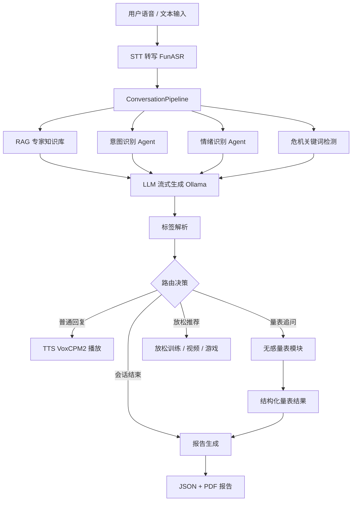
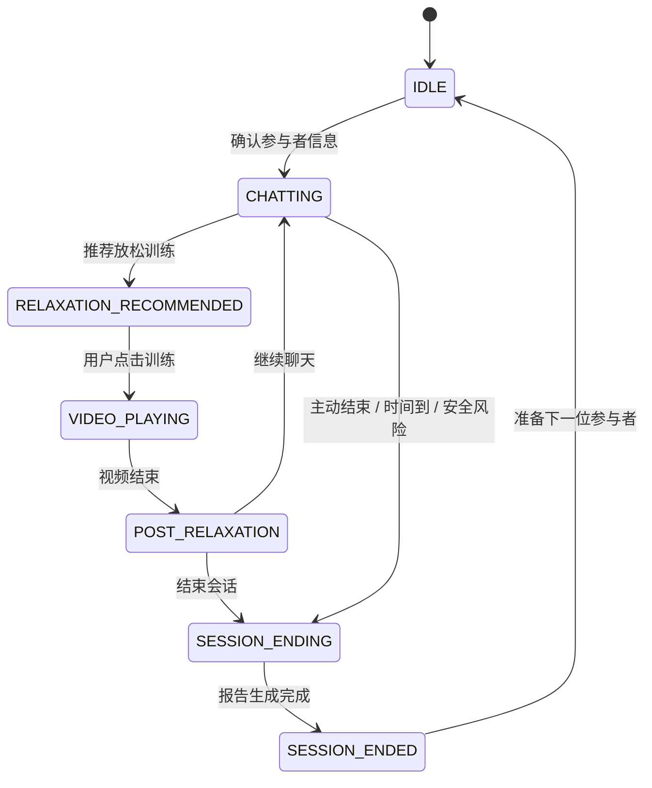
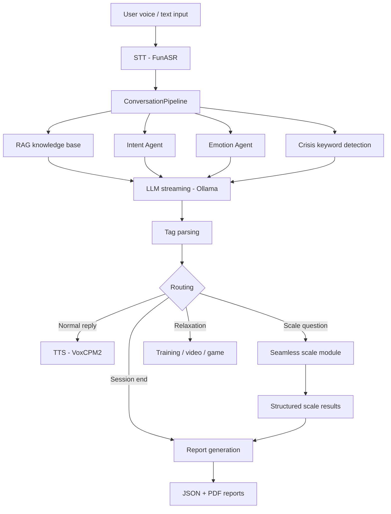
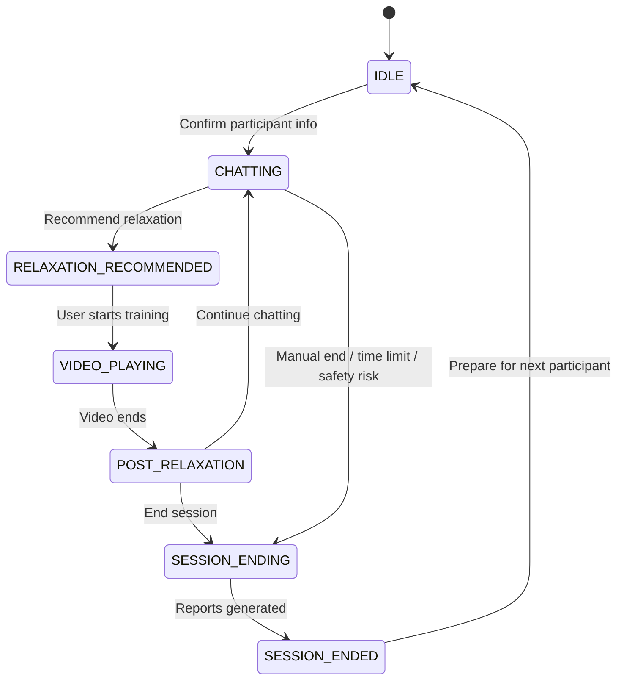

# 心医生 Heart Doctor

> 面向戒治与封闭式康复场景的本地化 AI 心理咨询语音系统
> Local-first AI voice counseling system for closed rehabilitation environments.


**[English](#english)** | **[中文](#中文)**

---

<a id="中文"></a>

## 中文

### 1. 项目简介

**心医生 Heart Doctor** 是一个面向强制隔离戒毒所、封闭式康复机构、心理健康研究场景的本地化 AI 心理咨询语音系统。系统通过语音识别、大语言模型、情绪识别、心理量表、RAG 专家知识库、放松训练与自动化报告生成，构建一套完整的"对话—评估—干预—报告"闭环。

本项目重点解决封闭环境中的几个实际问题：

* 来访者文化水平差异较大，传统量表填写依从性不足；
* 戒治环境中焦虑、抑郁、失眠、创伤反应等心理问题较常见；
* 人工心理访谈资源有限，难以持续进行初筛、陪伴与记录；
* 研究场景需要结构化数据、逐题评分、报告留痕和可复核流程；
* 封闭场所不适合依赖手机、网络、社交平台等常规心理干预方式。

系统采用桌面端本地运行方案，核心模型与数据均可部署在本机或局域网环境中，适合隐私要求较高、网络受限或无法直接使用公网 API 的场景。

---

### 2. 核心能力

#### 2.1 语音心理咨询对话

系统支持自然语音输入与文字输入。用户可以像和咨询师聊天一样表达烦躁、焦虑、失眠、情绪低落、人际冲突、戒断压力等问题，系统根据上下文生成口语化回应并通过 TTS 播放。

```text
用户语音 / 文本
    ↓
STT 语音转写
    ↓
意图识别 + 情绪识别 + 危机关键词检测
    ↓
RAG 专家知识库增强
    ↓
LLM 流式生成
    ↓
标签解析：END / REC / SCALE
    ↓
TTS 语音播放
    ↓
UI 路由：继续对话 / 推荐放松 / 结束会话 / 生成报告
```

---

#### 2.2 动机访谈取向的对话策略

系统提示词围绕动机访谈（Motivational Interviewing, MI）与支持性访谈逻辑设计，强调：

* 开放式提问；
* 共情性反映；
* 肯定与支持；
* 双面反映；
* 避免说教、命令和评判；
* 关注来访者自己的改变动机；
* 在风险场景下优先进行安全处理。

---

#### 2.3 无感心理量表评估

系统内置 PHQ-9、GAD-7、PCL-5 简版等结构化量表，但不会告诉来访者"现在开始做量表"。量表问题被转写为自然访谈语言。

```text
原始条目：入睡困难、睡不安稳或睡得太多
自然问法：睡眠怎么样，入睡、睡踏实，或者睡太多这几种情况有没有？
```

后台完成：

* 前若干轮优先建立关系，不立即进入量表；
* 已开始的量表继续完成，不被新量表打断；
* 多个量表触发时进入队列；
* 用户回答如"一半以上的天数"可自动推断分值；
* 每道题记录题号、原始条目、分数、选项标签；
* 量表完成后计算总分、严重程度、完成状态；
* 写入 JSON 报告与 PDF 报告。

---

#### 2.4 放松训练推荐

根据对话内容、情绪状态或量表完成情况，自动推荐：

* 呼吸放松；
* 渐进式肌肉放松；
* 冥想正念训练；
* 轻量放松小游戏。

示例引导语：

```text
刚才我们把最近这段时间的状态大致捋清楚了。
现在可以做个短的呼吸放松，让身体也缓一缓。
```

---

#### 2.5 自动化研究报告

会话结束后自动生成：

1. **来访者反馈** — 温和口语化的结束语，TTS 播放。
2. **研究员报告** — 结构化 JSON + PDF，包含：
   * 基本信息、轮次、时长；
   * 情绪状态、风险等级、主要问题；
   * PHQ-9 / GAD-7 / PCL-5 逐题评分、总分、严重程度；
   * 放松训练完成情况；
   * 干预建议。

---

#### 2.6 本地数据留存

每位参与者的数据按日期和编号保存到本地：

* 用户语音、转写文本、AI 回复；
* 结构化 JSON 报告、PDF 报告；
* 放松训练记录、情绪识别记录、系统日志。

---

### 3. 系统架构

#### 3.1 总体架构



---

#### 3.2 会话状态机



---

### 4. 技术栈

| 层级 | 技术 / 模块 | 说明 |
|------|-------------|------|
| 桌面 UI | PySide6 | 主窗口、控制面板、对话面板、弹窗 |
| 语音识别 | FunASR | 本地语音转写 |
| 大语言模型 | Ollama | 本地或局域网 LLM 服务 |
| 小模型 Agent | Ollama / AgentService | 意图分类、情绪识别、报告辅助 |
| 语音合成 | VoxCPM2 | 本地 TTS、音色克隆、流式播放 |
| 视频/游戏 | pygame / moviepy | 放松视频、小游戏 |
| 报告生成 | ReportLab | PDF 报告 |
| 数据管理 | JSON + WAV + TXT | 本地结构化存储 |
| 测试 | pytest | 单元测试 |
| 配置 | config.py + 环境变量 | 模型路径、提示词、阈值 |

---

### 5. 安装与运行

#### 5.1 环境要求

* Windows 10 / 11
* Python 3.10+
* NVIDIA GPU（推荐）
* Ollama 已安装
* FunASR 与 VoxCPM2 模型已下载
* 麦克风与音频输出设备

#### 5.2 安装步骤

```bash
git clone https://github.com/jersery66/voicechat3.git
cd voicechat3
python -m venv .venv
.venv\Scripts\activate          # Windows
# source .venv/bin/activate     # macOS / Linux
pip install -r requirements.txt
```

#### 5.3 配置环境变量

```powershell
$env:OLLAMA_HOST="http://localhost:11434"
$env:VOXCPM_MODEL_PATH="D:\models\VoxCPM2"
$env:VOICE_PROMPT_PATH="D:\models\voice_prompt\s1.wav"
```

#### 5.4 启动

```bash
python main.py
```

---

### 6. 基本使用流程

1. 启动后填写参与者信息并确认；
2. 通过语音或文字开始对话；
3. 前几轮建立关系，之后系统自然进入症状评估；
4. 量表完成后推荐放松训练；
5. 用户选择继续聊天或结束会话；
6. 结束时自动生成报告。

---

### 7. 数据保存结构

```text
data/
└── 2026-05-29/
    └── subject_001/
        ├── metadata.json
        ├── 001_user.wav / .txt
        ├── 001_assistant.txt
        ├── session_summary.json
        ├── researcher_report.json
        └── report.pdf
```

---

### 8. 控制标签协议

#### 回复分隔符

```text
后台分析 ||| 口语回复
```

#### 结束标签

```text
[END_GOAL_ACHIEVED] [END_TIME_LIMIT] [END_SAFETY] [END_QUIT]
```

#### 放松推荐标签

```text
[REC_BREATHING] [REC_MUSCLE] [REC_MEDITATION] [REC_GAME]
```

#### 量表评分标签

```text
[SCALE:PHQ-9:Q1:S2]  [SCALE:GAD-7:Q3:S1]  [SCALE:PCL-5:Q4:S3]
```

标签不会展示给用户，不会进入 TTS，仅用于后台评分与报告。

---

### 9. 配置说明

```python
MIN_ROUNDS_BEFORE_SCALE = 5    # 前几轮不启动新量表
MIN_ROUNDS_FOR_RELAXATION = 8  # 过早阶段不推荐放松
POST_RELAXATION_TIMEOUT = 60   # 放松后等待选择的超时时间
```

---

### 10. 安全与伦理声明

本项目用于心理健康研究与辅助访谈，不构成正式医学诊断或治疗建议。对自杀、自伤、暴力风险等高危场景，应立即转交专业人员。研究使用前应获得机构伦理审批。

---

### 11. 许可证

本项目采用 [MIT License](LICENSE)。

---

---

<a id="english"></a>

## English

### 1. Overview

**Heart Doctor (心医生)** is a local-first AI voice counseling system designed for mandatory rehabilitation facilities, closed recovery environments, and mental health research settings. It integrates speech recognition, large language models, emotion detection, psychological scales, RAG knowledge base, relaxation training, and automated report generation into a complete "dialogue — assessment — intervention — report" pipeline.

Key problems addressed:

* Low compliance with traditional paper-based scales among participants with varying literacy levels;
* High prevalence of anxiety, depression, insomnia, and trauma responses in rehabilitation settings;
* Limited human counseling resources for continuous screening and monitoring;
* Research needs for structured data, per-item scoring, and auditable reports;
* Unsuitability of phone- or internet-based interventions in restricted environments.

The system runs as a desktop application. All core models and data can be deployed on the local machine or within a LAN, making it suitable for high-privacy, network-restricted scenarios.

---

### 2. Core Capabilities

#### 2.1 Voice Counseling Dialogue

Supports natural voice and text input. Users express their concerns conversationally; the system generates spoken responses via LLM and plays them back through TTS.

```text
User voice / text
    ↓
STT transcription
    ↓
Intent + emotion + crisis keyword detection
    ↓
RAG knowledge base augmentation
    ↓
LLM streaming generation
    ↓
Tag parsing: END / REC / SCALE
    ↓
TTS playback
    ↓
UI routing: continue / recommend relaxation / end session / generate reports
```

---

#### 2.2 Motivational Interviewing Approach

System prompts follow Motivational Interviewing (MI) and supportive counseling principles:

* Open-ended questions;
* Empathic reflections;
* Affirmations and support;
* Double-sided reflections;
* Avoiding lecturing, commanding, or judging;
* Focusing on the user's own motivation for change;
* Prioritizing safety in risk scenarios.

---

#### 2.3 Seamless Psychological Scales

Built-in PHQ-9, GAD-7, and PCL-5 short form — administered as natural conversation, never labeled as "questionnaire" or "question #N" to the user.

```text
Original item: Difficulty falling asleep, staying asleep, or sleeping too much
Natural phrasing: How's your sleep been — trouble falling asleep, waking up a lot, or sleeping more than usual?
```

Backend handles:

* Rapport-building in early rounds before starting any scale;
* Active scales continue to completion without interruption;
* Multiple scales queued when triggered simultaneously;
* Automatic score inference from responses like "more than half the days";
* Per-item recording of question number, original text, score, and label;
* Total score, severity level, and completion status computed on completion;
* Results written to JSON and PDF reports.

---

#### 2.4 Relaxation Training Recommendation

Automatically recommends relaxation based on conversation content, emotional state, or scale completion:

* Breathing exercises;
* Progressive muscle relaxation;
* Mindfulness meditation;
* Light relaxation games.

Example guidance:

```text
We've gone through how things have been for you recently.
Now let's do a short breathing exercise to help your body relax a bit.
```

---

#### 2.5 Automated Research Reports

Generated automatically at session end:

1. **Visitor feedback** — warm, conversational farewell played via TTS.
2. **Researcher report** — structured JSON + PDF including:
   * Basic info, round count, duration;
   * Emotional state, risk level, identified issues;
   * PHQ-9 / GAD-7 / PCL-5 per-item scores, totals, severity;
   * Relaxation training completion;
   * Intervention recommendations.

---

#### 2.6 Local Data Retention

All participant data saved locally by date and ID:

* Audio recordings, transcriptions, AI responses;
* Structured JSON reports, PDF reports;
* Relaxation records, emotion tracking, system logs.

---

### 3. Architecture

#### 3.1 System Architecture



---

#### 3.2 Session State Machine



---

### 4. Tech Stack

| Layer | Technology | Description |
|-------|-----------|-------------|
| Desktop UI | PySide6 | Main window, panels, dialogs |
| Speech recognition | FunASR | Local STT |
| LLM | Ollama | Local / LAN LLM service |
| Agent models | Ollama / AgentService | Intent, emotion, report assist |
| TTS | VoxCPM2 | Local synthesis, voice cloning, streaming |
| Video / Games | pygame / moviepy | Relaxation media |
| Reports | ReportLab | PDF generation |
| Data | JSON + WAV + TXT | Local structured storage |
| Testing | pytest | Unit tests |
| Config | config.py + env vars | Model paths, prompts, thresholds |

---

### 5. Installation

#### 5.1 Requirements

* Windows 10 / 11
* Python 3.10+
* NVIDIA GPU (recommended)
* Ollama installed
* FunASR and VoxCPM2 models downloaded
* Microphone and audio output

#### 5.2 Setup

```bash
git clone https://github.com/jersery66/voicechat3.git
cd voicechat3
python -m venv .venv
.venv\Scripts\activate          # Windows
# source .venv/bin/activate     # macOS / Linux
pip install -r requirements.txt
```

#### 5.3 Environment Variables

```powershell
$env:OLLAMA_HOST="http://localhost:11434"
$env:VOXCPM_MODEL_PATH="D:\models\VoxCPM2"
$env:VOICE_PROMPT_PATH="D:\models\voice_prompt\s1.wav"
```

#### 5.4 Launch

```bash
python main.py
```

---

### 6. Usage Flow

1. Launch and confirm participant information;
2. Start conversation via voice or text;
3. Early rounds build rapport; system naturally transitions to symptom assessment;
4. After scales complete, relaxation training is recommended;
5. User chooses to continue chatting or end the session;
6. Reports are generated automatically at session end.

---

### 7. Data Structure

```text
data/
└── 2026-05-29/
    └── subject_001/
        ├── metadata.json
        ├── 001_user.wav / .txt
        ├── 001_assistant.txt
        ├── session_summary.json
        ├── researcher_report.json
        └── report.pdf
```

---

### 8. Control Tag Protocol

#### Response Delimiter

```text
internal analysis ||| spoken response
```

#### End Tags

```text
[END_GOAL_ACHIEVED] [END_TIME_LIMIT] [END_SAFETY] [END_QUIT]
```

#### Relaxation Recommendation Tags

```text
[REC_BREATHING] [REC_MUSCLE] [REC_MEDITATION] [REC_GAME]
```

#### Scale Scoring Tags

```text
[SCALE:PHQ-9:Q1:S2]  [SCALE:GAD-7:Q3:S1]  [SCALE:PCL-5:Q4:S3]
```

Tags are never shown to the user or played via TTS. They are used only for backend scoring and reporting.

---

### 9. Configuration

```python
MIN_ROUNDS_BEFORE_SCALE = 5    # Don't start new scales in early rounds
MIN_ROUNDS_FOR_RELAXATION = 8  # Don't recommend relaxation too early
POST_RELAXATION_TIMEOUT = 60   # Seconds to wait for user choice after relaxation
```

---

### 10. Safety and Ethics

This project is designed for mental health research and辅助访谈. It does not constitute a formal medical diagnosis or treatment. For suicidal ideation, self-harm, violence risk, or severe psychiatric symptoms, immediately refer to qualified professionals. Institutional ethics approval is required for research use.

---

### 11. License

This project is licensed under the [MIT License](LICENSE).

---

> 科技不是替代人的温度，而是让有限的陪伴被更好地延伸。
> Technology doesn't replace human warmth — it extends the reach of limited companionship.
