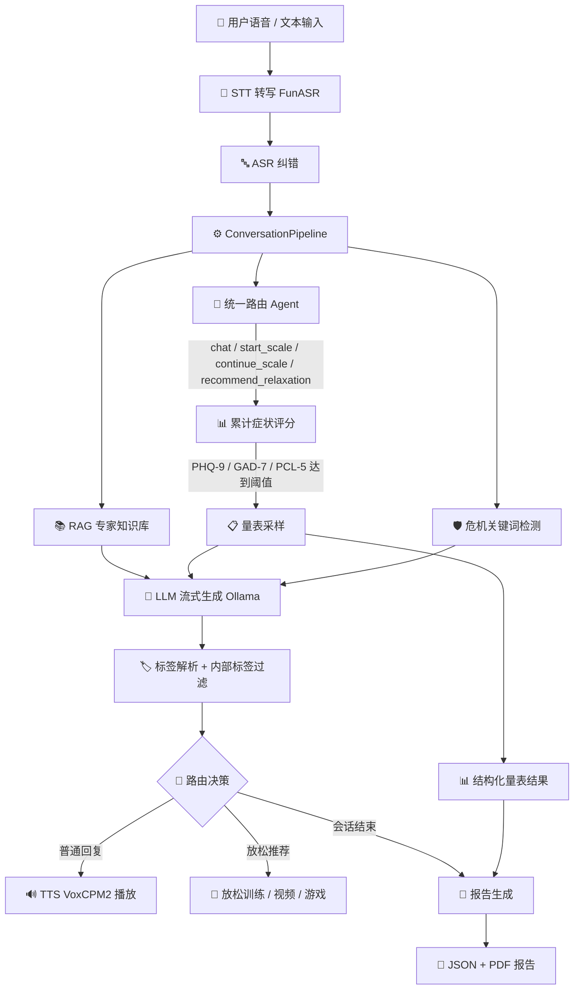
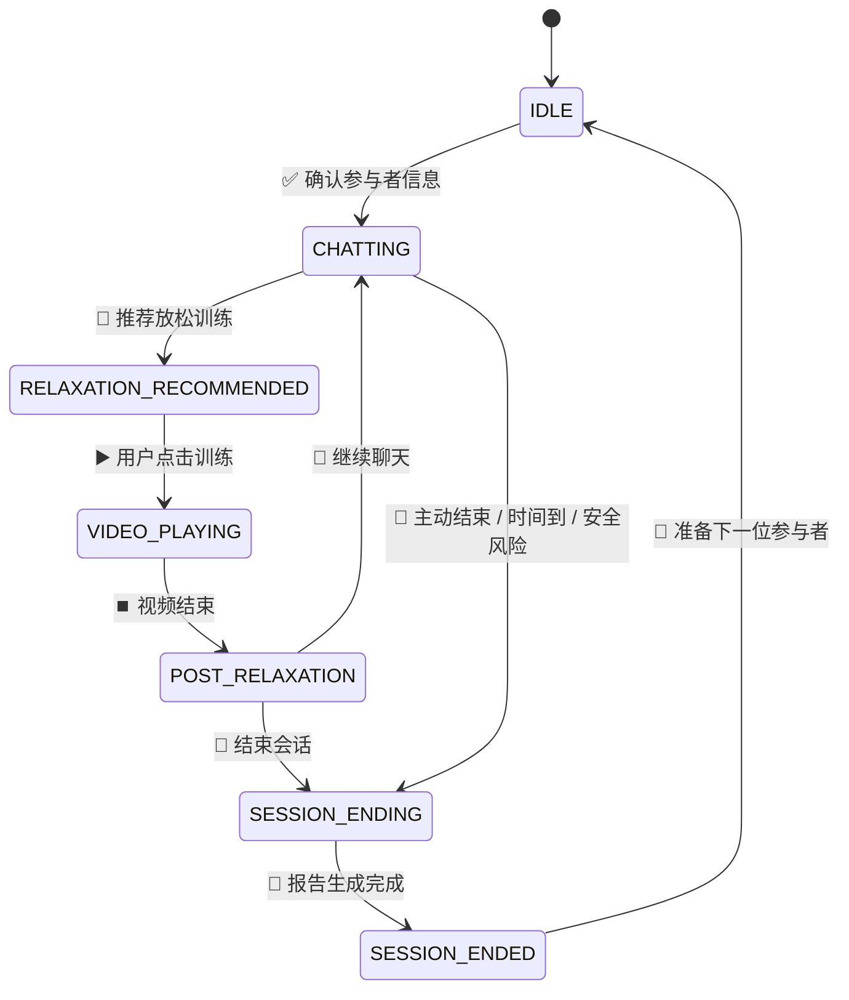
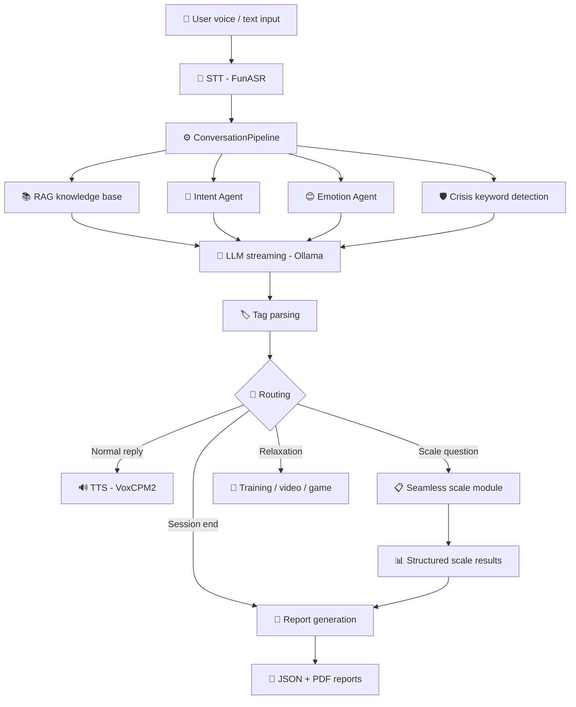
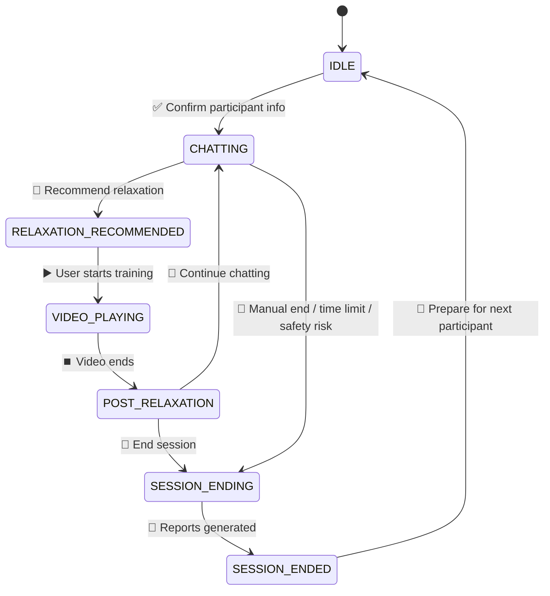

# 💚 心医生 Heart Doctor

> 🏥 面向戒治与封闭式康复场景的本地化 AI 心理咨询语音系统
> 🌐 Local-first AI voice counseling system for closed rehabilitation environments.


**[🌐 English](#english)** | **[🇨🇳 中文](#中文)**

---

<a id="中文"></a>

## 🇨🇳 中文

### 📖 1. 项目简介

**心医生 Heart Doctor** 是一个面向强制隔离戒毒所、封闭式康复机构、心理健康研究场景的本地化 AI 心理咨询语音系统。系统通过语音识别、大语言模型、情绪识别、心理量表、RAG 专家知识库、放松训练与自动化报告生成，构建一套完整的 **"对话—评估—干预—报告"** 闭环。

🎯 本项目重点解决封闭环境中的几个实际问题：

* 👥 来访者文化水平差异较大，传统量表填写依从性不足；
* 😟 戒治环境中焦虑、抑郁、失眠、创伤反应等心理问题较常见；
* 🧑‍⚕️ 人工心理访谈资源有限，难以持续进行初筛、陪伴与记录；
* 📊 研究场景需要结构化数据、逐题评分、报告留痕和可复核流程；
* 🔒 封闭场所不适合依赖手机、网络、社交平台等常规心理干预方式。

系统采用桌面端本地运行方案，核心模型与数据均可部署在本机或局域网环境中，适合隐私要求较高、网络受限或无法直接使用公网 API 的场景。

---

### ✨ 2. 核心能力

#### 🎙️ 2.1 语音心理咨询对话

系统支持自然语音输入与文字输入。用户可以像和咨询师聊天一样表达烦躁、焦虑、失眠、情绪低落、人际冲突、戒断压力等问题，系统根据上下文生成口语化回应并通过 TTS 播放。

```text
🎤 用户语音 / 文本
    ↓
📝 STT 语音转写
    ↓
🧠 意图识别 + 情绪识别 + 危机关键词检测
    ↓
📚 RAG 专家知识库增强
    ↓
💬 LLM 流式生成
    ↓
🏷️ 标签解析：END / REC / SCALE
    ↓
🔊 TTS 语音播放
    ↓
🖥️ UI 路由：继续对话 / 推荐放松 / 结束会话 / 生成报告
```

---

#### 💬 2.2 动机访谈取向的对话策略

系统提示词围绕动机访谈（Motivational Interviewing, MI）与支持性访谈逻辑设计，强调：

* ❓ 开放式提问；
* 💗 共情性反映；
* 👍 肯定与支持；
* 🔄 双面反映；
* 🚫 避免说教、命令和评判；
* 🌱 关注来访者自己的改变动机；
* 🛡️ 在风险场景下优先进行安全处理。

---

#### 📋 2.3 无感心理量表评估

系统内置 PHQ-9、GAD-7、PCL-5 简版等结构化量表，但 **不会告诉来访者"现在开始做量表"**。量表问题被转写为自然访谈语言。

```text
📝 原始条目：入睡困难、睡不安稳或睡得太多
💬 自然问法：最近睡眠怎么样？是比较难睡着、容易醒，还是反而睡得特别多？
```

🎯 **量表触发机制**：系统使用累计症状信号评分，每轮根据用户表达为三个量表独立加分：

| 信号 | 加分 | 示例 |
|------|------|------|
| 低落情绪词 | PHQ-9 +1 | 不开心/难受/低落/痛苦 |
| 无因低落 | PHQ-9 +2 | "没有原因就是不开心" |
| 持续性词 | 所有量表 +1 | 最近/一直/经常/很久了 |
| 焦虑词 | GAD-7 +2 | 焦虑/紧张/担心/心慌 |
| 创伤词 | PCL-5 +2 | 噩梦/创伤/闪回 |

当某个量表累计分 ≥ 3 时，系统自然进入该量表的采样。

后台完成：

* ⏰ 前若干轮优先建立关系，通过累计信号判断何时启动量表；
* 🔄 已开始的量表继续完成，不被新量表打断；
* 🔢 用户回答如"一半以上的天数"可自动推断分值；
* 📝 每道题记录题号、原始条目、分数、选项标签；
* 📊 量表完成后计算总分、严重程度、完成状态；
* 💾 写入 JSON 报告与 PDF 报告。

---

#### 🧘 2.4 放松训练推荐

系统根据对话内容、情绪状态自动推荐放松训练。推荐规则：

* ⏰ **一个对话最多推荐一次**放松训练；
* 🚫 **量表答题期间不推荐**（`waiting_scale_answer=True` 时禁止）；
* 🔄 放松训练可在量表间隙插入，但必须等当前题完成后；
* 📋 放松结束后系统主动恢复量表，继续补问未完成的问题。

支持的放松方式：

* 🌬️ 呼吸放松；
* 💪 渐进式肌肉放松；
* 🧘 冥想正念训练；
* 🎮 轻量放松小游戏。

示例引导语：

```text
刚才我们把最近这段时间的状态大致捋清楚了。
现在可以做个短的呼吸放松，让身体也缓一缓。
```

---

#### 📄 2.5 自动化研究报告

会话结束后自动生成：

1. **🎤 来访者反馈** — 温和口语化的结束语，TTS 播放。
2. **📊 研究员报告** — 结构化 JSON + PDF，包含：
   * 👤 基本信息、轮次、时长；
   * 😊 情绪状态、风险等级、主要问题；
   * 📋 PHQ-9 / GAD-7 / PCL-5 逐题评分、总分、严重程度；
   * 🧘 放松训练完成情况；
   * 💡 干预建议。

---

#### 💾 2.6 本地数据留存

每位参与者的数据按日期和编号保存到本地：

* 🎵 用户语音、转写文本、AI 回复；
* 📊 结构化 JSON 报告、PDF 报告；
* 📝 放松训练记录、情绪识别记录、系统日志。

---

### 🏗️ 3. 系统架构

#### 3.1 总体架构



---

#### 3.2 会话状态机



---

### 🛠️ 4. 技术栈

| 层级 | 技术 / 模块 | 说明 |
|------|-------------|------|
| 🖥️ 桌面 UI | PySide6 | 主窗口、控制面板、对话面板、弹窗 |
| 🎤 语音识别 | FunASR | 本地语音转写 |
| 🧠 大语言模型 | Ollama | 本地或局域网 LLM 服务 |
| 🤖 小模型 Agent | Ollama / AgentService | 意图分类、情绪识别、报告辅助 |
| 🔊 语音合成 | VoxCPM2 | 本地 TTS、音色克隆、流式播放 |
| 🎬 视频/游戏 | pygame / moviepy | 放松视频、小游戏 |
| 📄 报告生成 | ReportLab | PDF 报告 |
| 💾 数据管理 | JSON + WAV + TXT | 本地结构化存储 |
| 🧪 测试 | pytest | 单元测试 |
| ⚙️ 配置 | config.py + 环境变量 | 模型路径、提示词、阈值 |

---

### 🚀 5. 安装与运行

#### 📋 5.1 环境要求

| 项目 | 要求 |
|------|------|
| 💻 操作系统 | Windows 10 / 11 |
| 🐍 Python | 3.10 或更高版本 |
| 🎮 GPU | NVIDIA GPU（推荐，用于 LLM 和 TTS 加速） |
| 🧠 内存 | 16GB+ 推荐 |
| 🎤 麦克风 | 需要（语音输入） |
| 🔊 音频输出 | 需要（TTS 播放） |

---

#### 📥 5.2 第一步：克隆项目

```bash
git clone https://github.com/jersery66/voicechat3.git
cd voicechat3
```

---

#### 🐍 5.3 第二步：创建 Python 虚拟环境

```bash
python -m venv .venv
```

激活虚拟环境：

```bash
# Windows CMD
.venv\Scripts\activate.bat

# Windows PowerShell
.venv\Scripts\Activate.ps1

# macOS / Linux
source .venv/bin/activate
```

---

#### 📦 5.4 第三步：安装 Python 依赖

```bash
pip install -r requirements.txt
```

如果需要开发测试依赖：

```bash
pip install -r requirements-dev.txt
```

---

#### 🧠 5.5 第四步：安装并配置 Ollama（LLM 服务）

**5.5.1 安装 Ollama**

访问 [ollama.com](https://ollama.com) 下载并安装 Ollama。

**5.5.2 拉取对话模型**

```bash
# 推荐模型（根据显存选择）
ollama pull qwen2.5:72b      # 推荐，约 40GB 显存
ollama pull qwen2.5:14b      # 备选，约 10GB 显存
ollama pull qwen2.5:8b       # 轻量，约 6GB 显存
```

**5.5.3 启动 Ollama 服务**

```bash
ollama serve
```

默认监听 `http://localhost:11434`。

> 💡 **提示**：系统会自动检测本机已安装的 Ollama 模型，并优先选择合适的模型。也可以通过环境变量 `OLLAMA_MODEL` 指定。

---

#### 🎤 5.6 第五步：准备语音识别模型（FunASR）

FunASR 用于将用户语音转写为文本。

**方式一：自动下载**

首次运行时，系统会尝试自动下载 FunASR 模型。

**方式二：手动下载**

从 ModelScope 或 HuggingFace 下载 FunASR 模型到本地目录，然后设置环境变量：

```powershell
$env:FUNASR_MODEL_PATH="D:\models\Fun-ASR-Nano-2512"
```

---

#### 🔊 5.7 第六步：准备语音合成模型（VoxCPM2）

VoxCPM2 用于将 AI 回复转换为语音播放。

**5.7.1 下载 VoxCPM2 模型**

从 ModelScope 下载 VoxCPM2 模型到本地目录。

**5.7.2 准备参考音频（音色克隆）**

准备一段 5-10 秒的清晰语音文件（WAV 格式），以及对应的文本内容。系统会用这段音频作为音色参考。

**5.7.3 设置环境变量**

```powershell
$env:VOXCPM_MODEL_PATH="D:\models\VoxCPM2"
$env:VOICE_PROMPT_PATH="D:\models\voice_prompt\s1.wav"
$env:VOICE_PROMPT_TEXT="这里填写参考音频对应的文本内容"
```

---

#### ⚙️ 5.8 第七步：配置环境变量（汇总）

创建一个启动脚本或在终端中设置：

```powershell
# Ollama 服务地址
$env:OLLAMA_HOST="http://localhost:11434"

# VoxCPM2 TTS 模型路径
$env:VOXCPM_MODEL_PATH="D:\models\VoxCPM2"

# 参考音频路径和文本
$env:VOICE_PROMPT_PATH="D:\models\voice_prompt\s1.wav"
$env:VOICE_PROMPT_TEXT="参考音频对应的文本"

# （可选）FunASR 模型路径
$env:FUNASR_MODEL_PATH="D:\models\Fun-ASR-Nano-2512"

# （可选）指定 Ollama 模型
$env:OLLAMA_MODEL="qwen2.5:72b"
```

> 💡 也可以创建一个 `start.ps1` 或 `start.bat` 脚本，把这些环境变量写进去，一键启动。

---

#### ▶️ 5.9 第八步：启动程序

```bash
python main.py
```

🎉 启动后系统会：

1. 📝 初始化日志；
2. ✅ 检查配置；
3. 🖥️ 加载 UI 界面；
4. ⏳ 后台加载 STT、LLM、TTS、RAG、Agent 模型；
5. 📊 显示加载进度；
6. 🏠 进入主界面；
7. 👤 提示填写参与者信息；
8. 💬 开始会话。

---

#### ❓ 5.10 常见安装问题

**Q：`pip install` 报错网络超时？**

```bash
pip install -r requirements.txt -i https://pypi.tuna.tsinghua.edu.cn/simple
```

**Q：Ollama 连不上？**

确认 `ollama serve` 已在运行，且端口 11434 未被占用。

**Q：VoxCPM2 加载失败？**

检查 `VOXCPM_MODEL_PATH` 是否指向正确的模型目录（应包含 `config.json`）。

**Q：没有声音播放？**

检查系统默认音频输出设备是否正常，`sounddevice` 依赖 PortAudio。

---

### 🎯 6. 基本使用流程

1. 👤 启动后填写参与者信息并确认；
2. 🎤 通过语音或文字开始对话；
3. 💬 前几轮建立关系，之后系统自然进入症状评估；
4. 📋 量表完成后推荐放松训练；
5. 🧘 用户选择继续聊天或结束会话；
6. 📄 结束时自动生成报告。

---

### 📁 7. 数据保存结构

```text
data/
└── 📅 2026-05-29/
    └── 👤 subject_001/
        ├── 📋 metadata.json
        ├── 🎵 001_user.wav / 📝 .txt
        ├── 💬 001_assistant.txt
        ├── 📊 session_summary.json
        ├── 📄 researcher_report.json
        └── 📑 report.pdf
```

---

### 🏷️ 8. 控制标签协议

#### 📝 回复分隔符

```text
后台分析 ||| 口语回复
```

#### 🚪 结束标签

```text
[END_GOAL_ACHIEVED] [END_TIME_LIMIT] [END_SAFETY] [END_QUIT]
```

#### 🧘 放松推荐标签

```text
[REC_BREATHING] [REC_MUSCLE] [REC_MEDITATION] [REC_GAME]
```

#### 📊 量表评分标签

```text
[SCALE:PHQ-9:Q1:S2]  [SCALE:GAD-7:Q3:S1]  [SCALE:PCL-5:Q4:S3]
```

> 🔒 标签不会展示给用户，不会进入 TTS，仅用于后台评分与报告。

---

### ⚙️ 9. 配置说明

```python
MIN_ROUNDS_BEFORE_SCALE = 5    # 🔢 前几轮不启动新量表
MIN_ROUNDS_FOR_RELAXATION = 8  # ⏰ 过早阶段不推荐放松
POST_RELAXATION_TIMEOUT = 60   # ⏳ 放松后等待选择的超时时间
```

---

### ⚠️ 10. 安全与伦理声明

🛡️ 本项目用于心理健康研究与辅助访谈，不构成正式医学诊断或治疗建议。对自杀、自伤、暴力风险等高危场景，应立即转交专业人员。研究使用前应获得机构伦理审批。

---

### 📜 11. 许可证

本项目采用 [MIT License](LICENSE) 🎉。

---

---

<a id="english"></a>

## 🇬🇧 English

### 📖 1. Overview

**Heart Doctor (心医生)** 💚 is a local-first AI voice counseling system designed for mandatory rehabilitation facilities, closed recovery environments, and mental health research settings. It integrates speech recognition, large language models, emotion detection, psychological scales, RAG knowledge base, relaxation training, and automated report generation into a complete **"dialogue — assessment — intervention — report"** pipeline.

🎯 Key problems addressed:

* 👥 Low compliance with traditional paper-based scales among participants with varying literacy levels;
* 😟 High prevalence of anxiety, depression, insomnia, and trauma responses in rehabilitation settings;
* 🧑‍⚕️ Limited human counseling resources for continuous screening and monitoring;
* 📊 Research needs for structured data, per-item scoring, and auditable reports;
* 🔒 Unsuitability of phone- or internet-based interventions in restricted environments.

The system runs as a desktop application. All core models and data can be deployed on the local machine or within a LAN, making it suitable for high-privacy, network-restricted scenarios.

---

### ✨ 2. Core Capabilities

#### 🎙️ 2.1 Voice Counseling Dialogue

Supports natural voice and text input. Users express their concerns conversationally; the system generates spoken responses via LLM and plays them back through TTS.

```text
🎤 User voice / text
    ↓
📝 STT transcription
    ↓
🧠 Intent + emotion + crisis keyword detection
    ↓
📚 RAG knowledge base augmentation
    ↓
💬 LLM streaming generation
    ↓
🏷️ Tag parsing: END / REC / SCALE
    ↓
🔊 TTS playback
    ↓
🖥️ UI routing: continue / recommend relaxation / end session / generate reports
```

---

#### 💬 2.2 Motivational Interviewing Approach

System prompts follow Motivational Interviewing (MI) and supportive counseling principles:

* ❓ Open-ended questions;
* 💗 Empathic reflections;
* 👍 Affirmations and support;
* 🔄 Double-sided reflections;
* 🚫 Avoiding lecturing, commanding, or judging;
* 🌱 Focusing on the user's own motivation for change;
* 🛡️ Prioritizing safety in risk scenarios.

---

#### 📋 2.3 Seamless Psychological Scales

Built-in PHQ-9, GAD-7, and PCL-5 short form — administered as natural conversation, **never labeled as "questionnaire" or "question #N"** to the user.

```text
📝 Original item: Difficulty falling asleep, staying asleep, or sleeping too much
💬 Natural phrasing: How's your sleep been — trouble falling asleep, waking up a lot, or sleeping more than usual?
```

🎯 **Scale triggering**: The system uses cumulative symptom signal scoring. Each turn independently scores three scales based on user input:

| Signal | Score | Example |
|--------|-------|---------|
| Low mood words | PHQ-9 +1 | unhappy/sad/depressed |
| Unexplained sadness | PHQ-9 +2 | "no reason, just unhappy" |
| Duration words | All scales +1 | recently/always/for a long time |
| Anxiety words | GAD-7 +2 | anxious/worried/nervous |
| Trauma words | PCL-5 +2 | nightmare/trauma/flashback |

When any scale reaches ≥ 3, the system naturally transitions into that scale's assessment.

Backend handles:

* ⏰ Rapport-building in early rounds, cumulative signal-based scale triggering;
* 🔄 Active scales continue to completion without interruption;
* 🔢 Automatic score inference from responses like "more than half the days";
* 📝 Per-item recording of question number, original text, score, and label;
* 📊 Total score, severity level, and completion status computed on completion;
* 💾 Results written to JSON and PDF reports.

---

#### 🧘 2.4 Relaxation Training Recommendation

The system automatically recommends relaxation training based on conversation content and emotional state. Rules:

* ⏰ **At most one relaxation** per conversation session;
* 🚫 **Not recommended during active scale** (when `waiting_scale_answer=True`);
* 🔄 Can be inserted between scale items, but must wait for current item to complete;
* 📋 After relaxation ends, system resumes scale and continues asking remaining items.

Supported relaxation types:

* 🌬️ Breathing exercises;
* 💪 Progressive muscle relaxation;
* 🧘 Mindfulness meditation;
* 🎮 Light relaxation games.

Example guidance:

```text
We've gone through how things have been for you recently.
Now let's do a short breathing exercise to help your body relax a bit.
```

---

#### 📄 2.5 Automated Research Reports

Generated automatically at session end:

1. **🎤 Visitor feedback** — warm, conversational farewell played via TTS.
2. **📊 Researcher report** — structured JSON + PDF including:
   * 👤 Basic info, round count, duration;
   * 😊 Emotional state, risk level, identified issues;
   * 📋 PHQ-9 / GAD-7 / PCL-5 per-item scores, totals, severity;
   * 🧘 Relaxation training completion;
   * 💡 Intervention recommendations.

---

#### 💾 2.6 Local Data Retention

All participant data saved locally by date and ID:

* 🎵 Audio recordings, transcriptions, AI responses;
* 📊 Structured JSON reports, PDF reports;
* 📝 Relaxation records, emotion tracking, system logs.

---

### 🏗️ 3. Architecture

#### 3.1 System Architecture



---

#### 3.2 Session State Machine



---

### 🛠️ 4. Tech Stack

| Layer | Technology | Description |
|-------|-----------|-------------|
| 🖥️ Desktop UI | PySide6 | Main window, panels, dialogs |
| 🎤 Speech recognition | FunASR | Local STT |
| 🧠 LLM | Ollama | Local / LAN LLM service |
| 🤖 Agent models | Ollama / AgentService | Intent, emotion, report assist |
| 🔊 TTS | VoxCPM2 | Local synthesis, voice cloning, streaming |
| 🎬 Video / Games | pygame / moviepy | Relaxation media |
| 📄 Reports | ReportLab | PDF generation |
| 💾 Data | JSON + WAV + TXT | Local structured storage |
| 🧪 Testing | pytest | Unit tests |
| ⚙️ Config | config.py + env vars | Model paths, prompts, thresholds |

---

### 🚀 5. Installation

#### 📋 5.1 Requirements

| Item | Requirement |
|------|-------------|
| 💻 OS | Windows 10 / 11 |
| 🐍 Python | 3.10 or later |
| 🎮 GPU | NVIDIA GPU (recommended for LLM and TTS) |
| 🧠 RAM | 16GB+ recommended |
| 🎤 Microphone | Required (voice input) |
| 🔊 Audio output | Required (TTS playback) |

---

#### 📥 5.2 Step 1: Clone the Repository

```bash
git clone https://github.com/jersery66/voicechat3.git
cd voicechat3
```

---

#### 🐍 5.3 Step 2: Create Python Virtual Environment

```bash
python -m venv .venv
```

Activate:

```bash
# Windows CMD
.venv\Scripts\activate.bat

# Windows PowerShell
.venv\Scripts\Activate.ps1

# macOS / Linux
source .venv/bin/activate
```

---

#### 📦 5.4 Step 3: Install Python Dependencies

```bash
pip install -r requirements.txt
```

For development/testing:

```bash
pip install -r requirements-dev.txt
```

---

#### 🧠 5.5 Step 4: Install and Configure Ollama (LLM Service)

**5.5.1 Install Ollama**

Visit [ollama.com](https://ollama.com) to download and install Ollama.

**5.5.2 Pull a Chat Model**

```bash
# Recommended models (choose based on GPU memory)
ollama pull qwen2.5:72b      # Recommended, ~40GB VRAM
ollama pull qwen2.5:14b      # Alternative, ~10GB VRAM
ollama pull qwen2.5:8b       # Lightweight, ~6GB VRAM
```

**5.5.3 Start Ollama Service**

```bash
ollama serve
```

Default: listens on `http://localhost:11434`.

> 💡 **Tip**: The system auto-detects installed Ollama models and picks the best one. Override with `OLLAMA_MODEL` env var.

---

#### 🎤 5.6 Step 5: Prepare Speech Recognition Model (FunASR)

FunASR transcribes user speech to text.

**Option A: Auto-download**

The system will attempt to download the FunASR model on first run.

**Option B: Manual download**

Download from ModelScope or HuggingFace, then set:

```powershell
$env:FUNASR_MODEL_PATH="D:\models\Fun-ASR-Nano-2512"
```

---

#### 🔊 5.7 Step 6: Prepare Text-to-Speech Model (VoxCPM2)

VoxCPM2 converts AI responses to spoken audio.

**5.7.1 Download VoxCPM2 Model**

Download from ModelScope to a local directory.

**5.7.2 Prepare Reference Audio (Voice Cloning)**

Prepare a 5-10 second clear audio file (WAV format) and its corresponding text. The system uses this as a voice reference.

**5.7.3 Set Environment Variables**

```powershell
$env:VOXCPM_MODEL_PATH="D:\models\VoxCPM2"
$env:VOICE_PROMPT_PATH="D:\models\voice_prompt\s1.wav"
$env:VOICE_PROMPT_TEXT="Text content of the reference audio"
```

---

#### ⚙️ 5.8 Step 7: Configure Environment Variables (Summary)

Create a startup script or set in terminal:

```powershell
# Ollama service address
$env:OLLAMA_HOST="http://localhost:11434"

# VoxCPM2 TTS model path
$env:VOXCPM_MODEL_PATH="D:\models\VoxCPM2"

# Reference audio path and text
$env:VOICE_PROMPT_PATH="D:\models\voice_prompt\s1.wav"
$env:VOICE_PROMPT_TEXT="Reference audio text"

# (Optional) FunASR model path
$env:FUNASR_MODEL_PATH="D:\models\Fun-ASR-Nano-2512"

# (Optional) Specify Ollama model
$env:OLLAMA_MODEL="qwen2.5:72b"
```

> 💡 Create a `start.ps1` or `start.bat` script with these variables for one-click launch.

---

#### ▶️ 5.9 Step 8: Launch

```bash
python main.py
```

🎉 After launch, the system will:

1. 📝 Initialize logging;
2. ✅ Check configuration;
3. 🖥️ Load UI;
4. ⏳ Load STT, LLM, TTS, RAG, Agent models in background;
5. 📊 Show loading progress;
6. 🏠 Enter main interface;
7. 👤 Prompt for participant information;
8. 💬 Start session.

---

#### ❓ 5.10 Common Installation Issues

**Q: `pip install` times out?**

```bash
pip install -r requirements.txt -i https://pypi.tuna.tsinghua.edu.cn/simple
```

**Q: Can't connect to Ollama?**

Make sure `ollama serve` is running and port 11434 is not blocked.

**Q: VoxCPM2 fails to load?**

Check that `VOXCPM_MODEL_PATH` points to the correct directory (should contain `config.json`).

**Q: No audio playback?**

Check that the system's default audio output device is working. `sounddevice` depends on PortAudio.

---

### 🎯 6. Usage Flow

1. 👤 Launch and confirm participant information;
2. 🎤 Start conversation via voice or text;
3. 💬 Early rounds build rapport; system naturally transitions to symptom assessment;
4. 📋 After scales complete, relaxation training is recommended;
5. 🧘 User chooses to continue chatting or end the session;
6. 📄 Reports are generated automatically at session end.

---

### 📁 7. Data Structure

```text
data/
└── 📅 2026-05-29/
    └── 👤 subject_001/
        ├── 📋 metadata.json
        ├── 🎵 001_user.wav / 📝 .txt
        ├── 💬 001_assistant.txt
        ├── 📊 session_summary.json
        ├── 📄 researcher_report.json
        └── 📑 report.pdf
```

---

### 🏷️ 8. Control Tag Protocol

#### 📝 Response Delimiter

```text
internal analysis ||| spoken response
```

#### 🚪 End Tags

```text
[END_GOAL_ACHIEVED] [END_TIME_LIMIT] [END_SAFETY] [END_QUIT]
```

#### 🧘 Relaxation Recommendation Tags

```text
[REC_BREATHING] [REC_MUSCLE] [REC_MEDITATION] [REC_GAME]
```

#### 📊 Scale Scoring Tags

```text
[SCALE:PHQ-9:Q1:S2]  [SCALE:GAD-7:Q3:S1]  [SCALE:PCL-5:Q4:S3]
```

> 🔒 Tags are never shown to the user or played via TTS. They are used only for backend scoring and reporting.

---

### ⚙️ 9. Configuration

```python
MIN_ROUNDS_BEFORE_SCALE = 5    # 🔢 Don't start new scales in early rounds
MIN_ROUNDS_FOR_RELAXATION = 8  # ⏰ Don't recommend relaxation too early
POST_RELAXATION_TIMEOUT = 60   # ⏳ Seconds to wait for user choice after relaxation
```

---

### ⚠️ 10. Safety and Ethics

🛡️ This project is designed for mental health research and supportive counseling. It does not constitute a formal medical diagnosis or treatment. For suicidal ideation, self-harm, violence risk, or severe psychiatric symptoms, immediately refer to qualified professionals. Institutional ethics approval is required for research use.

---

### 📜 11. License

This project is licensed under the [MIT License](LICENSE) 🎉.

---

> 💚 科技不是替代人的温度，而是让有限的陪伴被更好地延伸。
> 🌐 Technology doesn't replace human warmth — it extends the reach of limited companionship.
