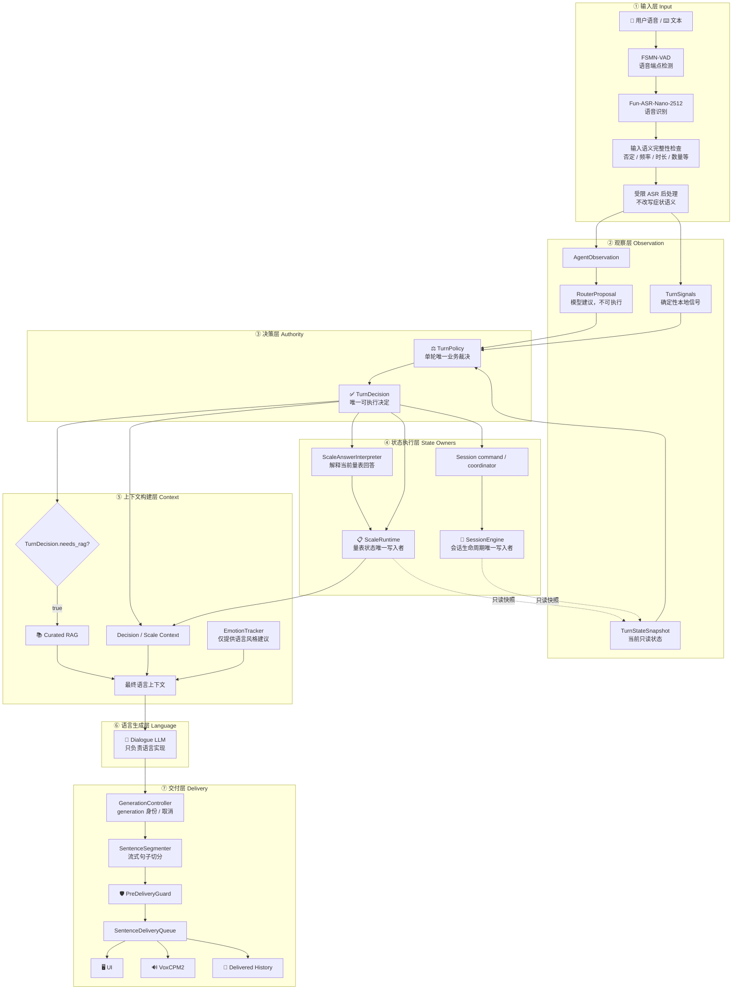
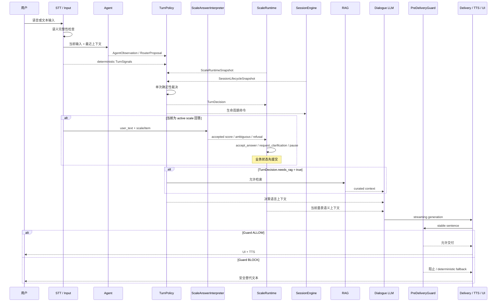
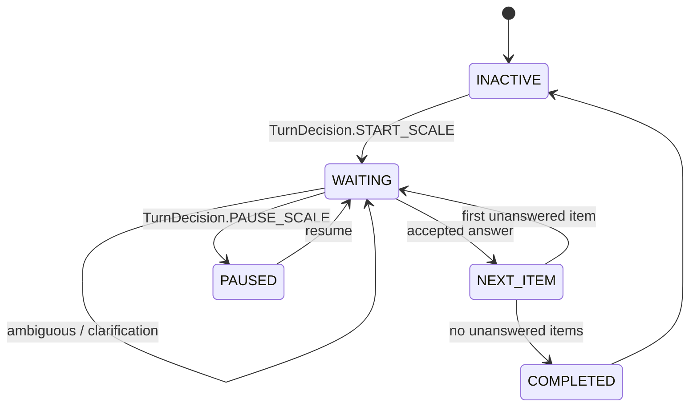
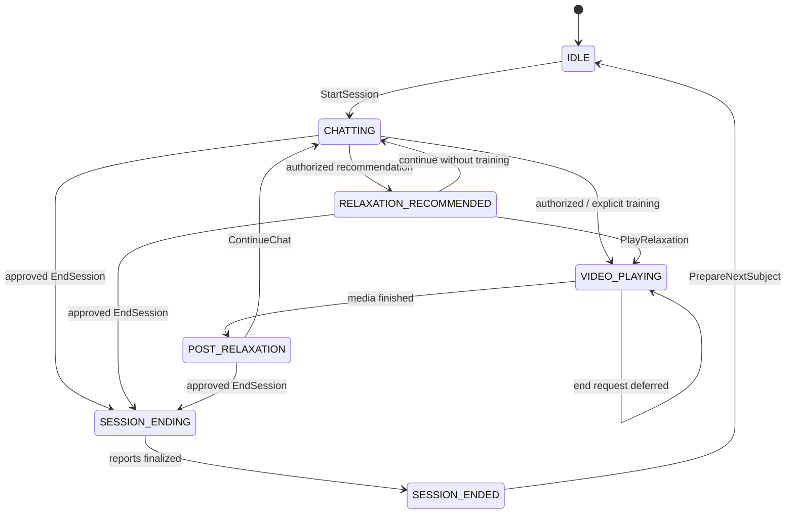
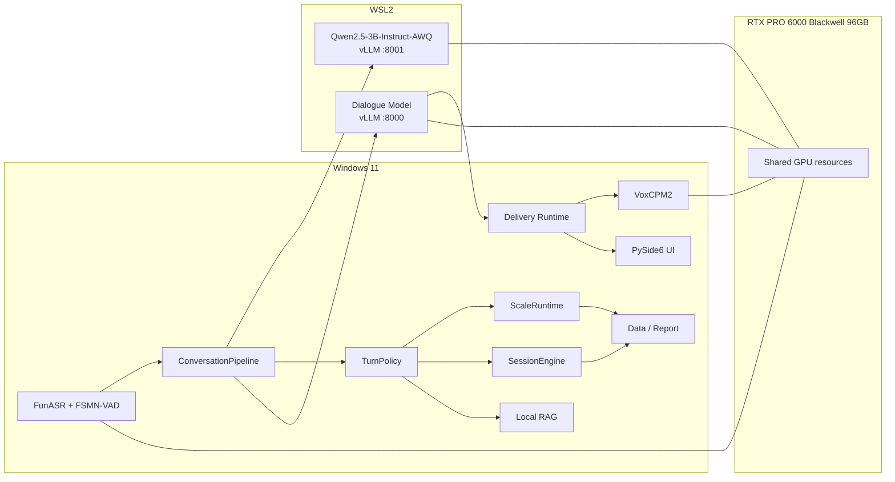
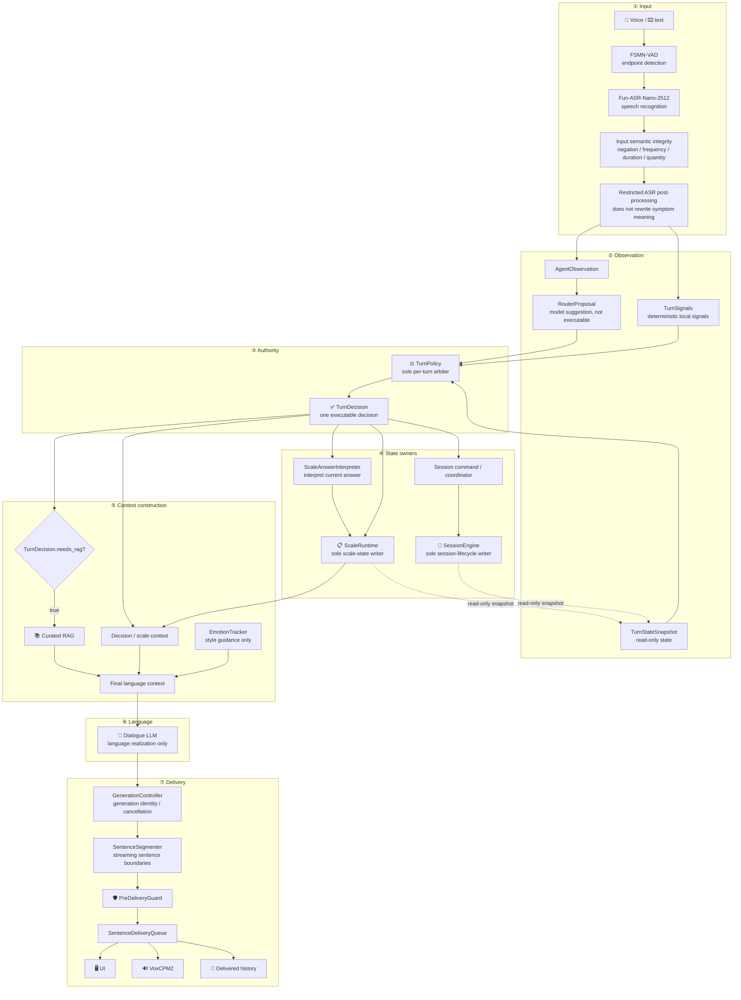
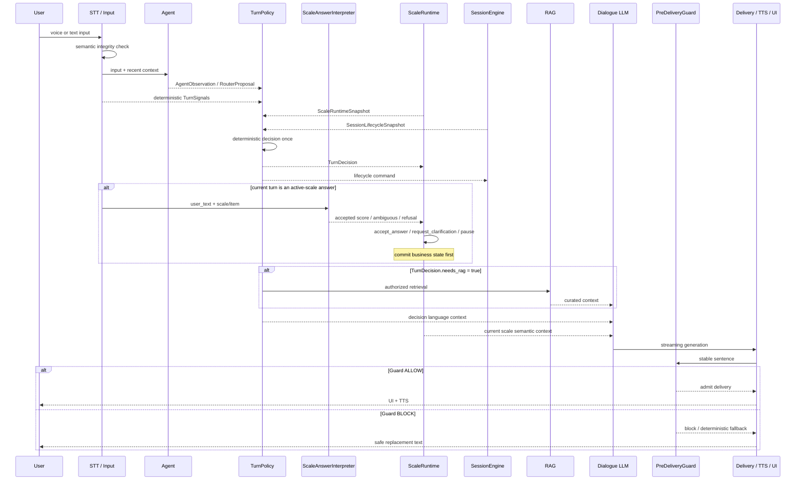

# 💚 心医生 Heart Doctor

> 🏥 面向戒治与封闭式康复场景的本地化 AI 心理支持与结构化评估语音系统
> 🌐 Local-first AI psychological-support and structured-assessment voice system for closed rehabilitation environments.


**[🌐 English](#english)** | **[🇨🇳 中文](#中文)**

---

<a id="中文"></a>

## 🇨🇳 中文

### 当前验证状态

```text
Software regression: 1011 passed / 0 failed
Pre-hardware validation tag: pre-hardware-validation-ready-v2-20260817
RTX PRO 6000: NOT RUN
WSL CUDA: NOT RUN
Real vLLM: NOT RUN
Real Phase 5: NOT RUN
Real A/B: NOT RUN
Real STT/TTS/E2E: NOT RUN
Qwen3.8 promotion: NOT APPROVED
```

软件回归通过不等于真实硬件部署通过。真实硬件、模型加载、性能和音频
链路必须在目标 Windows + WSL2 工作站上重新测量。

### 📖 1. 项目简介

**心医生 Heart Doctor** 是一个面向戒治与封闭式康复场景的本地化 AI
心理支持与结构化评估语音系统。系统提供支持性对话、结构化心理状态采集、
辅助训练与研究记录，不替代心理咨询师、精神科医生或机构危机处置流程，
也不承担诊断、治疗或专业咨询权威。

🎯 本项目重点解决封闭环境中的几个实际问题：

* 👥 来访者文化水平差异较大，传统量表填写依从性不足；
* 😟 戒治环境中焦虑、抑郁、失眠、创伤反应等心理问题较常见；
* 🧑‍⚕️ 人工心理访谈资源有限，难以持续进行初筛、陪伴与记录；
* 📊 研究场景需要结构化数据、逐题评分、报告留痕和可复核流程；
* 🔒 封闭场所不适合依赖手机、网络、社交平台等常规心理干预方式。

系统采用桌面端本地运行方案，核心模型与数据均可部署在本机或局域网环境中，适合隐私要求较高、网络受限或无法直接使用公网 API 的场景。

---

### ✨ 2. 核心能力

#### 🎙️ 2.1 语音心理咨询对话

系统支持自然语音输入与文字输入。用户可以用对话方式表达烦躁、焦虑、失眠、
情绪低落、人际冲突、戒断压力等问题，系统根据上下文生成支持性回应并通过
TTS 播放；专业判断和危机处置仍由机构流程与合格专业人员负责。

```text
🎤 用户语音 / 文本
    ↓
📝 STT 语音转写
    ↓
🔎 AgentObservation
   └─ RouterProposal（仅提供建议）
＋ deterministic TurnSignals
    ↓
⚖️ TurnPolicy
    ↓
✅ 唯一 TurnDecision
    ↓
📊 ScaleRuntime / SessionEngine / TurnDecision.needs_rag
    ↓
💬 Dialogue LLM 只负责语言实现
    ↓
🔊 句子交付 → TTS / UI / 历史记录
```

`RouterProposal` 不能直接启动量表、放松、游戏或结束会话；`TurnPolicy`
是每轮唯一的业务裁决者，系统只执行它产生的一个 `TurnDecision`。模型输出
不再承担业务控制协议，`TurnDecision.needs_rag` 是生产 RAG 的唯一检索门。
`AgentObservation` 的 intent/emotion 只用于观察和报告；`EmotionTracker` 只提供
语言风格建议，不能直接推荐具体训练。具体呼吸、肌肉或冥想训练，以及量表
暂停/恢复，必须由 `TurnPolicy → TurnDecision` 授权后执行。

---

#### 💬 2.2 动机访谈取向的对话策略

系统提示词围绕动机访谈（Motivational Interviewing, MI）与支持性访谈逻辑设计，强调：

* ❓ 开放式提问；
* 💗 共情性反映；
* 👍 肯定与支持；
* 🔄 双面反映；
* 🚫 避免说教、命令和评判；
* 🌱 关注来访者自己的改变动机；
* 🧭 对风险线索保持人工复核边界；实际危机处置须按机构流程交由专业人员完成。

---

#### 📋 2.3 无感心理量表评估

系统内置 PHQ-9、GAD-7、PCL-5 简版等结构化量表，但 **不会告诉来访者"现在开始做量表"**。量表问题被转写为自然访谈语言。

```text
📝 原始条目：入睡困难、睡不安稳或睡得太多
💬 自然问法：最近睡眠怎么样？是比较难睡着、容易醒，还是反而睡得特别多？
```

🎯 **量表触发机制**：系统使用累计症状信号评分，每轮根据用户表达为三个量表独立加分：

| 信号 | 加分 | 示例 |
|------|------|------|
| 低落情绪词 | PHQ-9 +1 | 不开心/难受/低落/痛苦 |
| 无因低落 | PHQ-9 +2 | "没有原因就是不开心" |
| 持续性词 | 所有量表 +1 | 最近/一直/经常/很久了 |
| 焦虑词 | GAD-7 +2 | 焦虑/紧张/担心/心慌 |
| 创伤词 | PCL-5 +2 | 噩梦/创伤/闪回 |

当某个量表累计分 ≥ 3 时，系统自然进入该量表的采样。

后台完成：

* ⏰ 前若干轮优先建立关系，通过累计信号判断何时启动量表；
* 🔄 已开始的量表继续完成，不被新量表打断；
* 🔢 用户回答如"一半以上的天数"可自动推断分值；
* 📝 每道题记录题号、原始条目、分数、选项标签；
* 📊 量表完成后计算总分、严重程度、完成状态；
* 💾 写入 JSON 报告与 PDF 报告。

---

#### 🧘 2.4 放松训练与授权边界

具体放松训练不是情绪模块或语言模型的隐式权力。`EmotionTracker` 只能影响
回应节奏、反映性倾听和支持性语言；只有 `TurnPolicy` 生成
`TurnDecision.RECOMMEND_RELAXATION` 时，Pipeline 才会加入具体训练引导。

用户明确要求某种方式时，明确类型优先于 Agent 建议；active scale 是否暂停、
训练结束后是否恢复量表，也都由 `TurnDecision` 进入既有 Runtime 流程。系统仍
遵守以下运行约束：

* ⏰ **一个会话最多完成一次**放松训练；
* 🚫 未经 `TurnDecision` 授权不得推荐具体训练；
* 🔄 active scale 的暂停/恢复必须由 Runtime 执行；
* 📋 放松结束后按现有状态恢复未完成的量表项目。

支持的放松方式：

* 🌬️ 呼吸放松；
* 💪 渐进式肌肉放松；
* 🧘 冥想正念训练；
* 🎮 轻量放松小游戏。

示例引导语：

```text
刚才我们把最近这段时间的状态大致捋清楚了。
现在可以做个短的呼吸放松，让身体也缓一缓。
```

---

#### 📄 2.5 自动化研究报告

会话结束后自动生成：

1. **🎤 来访者反馈** — 温和口语化的结束语，TTS 播放。
2. **📊 研究员报告** — 结构化 JSON + PDF，包含：
   * 👤 基本信息、轮次、时长；
   * 😊 情绪状态、主要问题；
   * 📋 PHQ-9 / GAD-7 / PCL-5 逐题评分、总分、严重程度；
   * 🧘 放松训练完成情况；
   * 💡 干预建议。

---

#### 💾 2.6 本地数据留存

每位参与者的数据按日期和编号保存到本地：

* 🎵 用户语音、转写文本、AI 回复；
* 📊 结构化 JSON 报告、PDF 报告；
* 📝 放松训练记录、情绪识别记录、系统日志。

---

### 🏗️ 3. 系统架构

本系统采用“**观察与决策分离、业务状态单一写入、语言生成无控制权、输出按 generation 隔离**”的架构。

系统中的大语言模型不直接启动量表、不直接修改量表进度、不直接结束会话，也不直接决定是否执行具体放松训练。每轮输入首先被转换为只读观察信息，再由确定性的 `TurnPolicy` 生成唯一的 `TurnDecision`。随后，各状态拥有者只执行该决定中属于自身职责的部分。

---

#### 3.1 架构分层

系统运行链可以分为七个相互隔离的层次：



这一结构中的关键原则是：

* Agent 只能提供观察与建议，不能执行行为；
* 本地规则产生的 `TurnSignals` 同样只是观察，不直接改变状态；
* `TurnPolicy` 每轮只生成一个不可变的 `TurnDecision`；
* `ScaleRuntime` 是量表题目、答案、评分、暂停、恢复和完成状态的唯一写入者；
* `SessionEngine` 是会话生命周期的唯一写入者；
* `TurnDecision.needs_rag` 是生产环境唯一的 RAG 检索门；
* Dialogue LLM 只负责把已经确定的业务意图表达成自然语言；
* EmotionTracker 只能调整回应节奏、反映性倾听等语言风格，不能授权具体干预；
* UI、TTS、历史记录和报告层不能反向改变业务决策。

---

#### 3.2 单轮对话执行流程

一次普通用户输入并不是直接交给大模型，而是经过“**观察 → 决策 → 状态提交 → 语言生成 → 安全交付**”五个阶段。



这里有一个重要的顺序约束：

```text
TurnDecision
    ↓
ScaleAnswerInterpreter
    ↓
ScaleRuntime business commit
    ↓
构建语言上下文
    ↓
Dialogue LLM
    ↓
PreDeliveryGuard
    ↓
UI / TTS
```

已经被确认的量表回答不会依赖后续 LLM 是否成功生成，也不会因为用户打断 TTS 或新的 generation 开始而被回滚。

---

#### 3.3 单轮业务决策边界

`ConversationPipeline` 负责组织上述阶段的调用顺序和数据传递，但不拥有独立业务决策权；它必须执行已经形成的 `TurnDecision`，不能在执行阶段重新选择另一业务动作。

对 `SessionEngine` 而言，`TurnDecision` 会先转换为生命周期命令，再提交给 single-writer engine；图中的箭头表示授权来源，不表示 `TurnPolicy` 直接写入 SessionEngine 内部状态。

`TurnPolicy` 接收三类只读输入：

```text
RouterProposal
+
TurnSignals
+
TurnStateSnapshot
        ↓
    TurnPolicy
        ↓
 ONE TurnDecision
```

**RouterProposal** 由 Agent 产生，可建议 `CHAT`、`START_SCALE`、
`RECOMMEND_RELAXATION`、`RECOMMEND_GAME` 或 `END_SESSION`，但没有直接执行权。
例如 Agent 建议 `START_SCALE → PHQ-9`，仍必须经过轮次限制、置信度、完成状态和确定性候选冲突等 `TurnPolicy` 规则。

**TurnSignals** 由本地确定性逻辑产生，包括明确结束/放松/小游戏请求、active scale 暂停或拒答、deterministic scale candidate、proactive relaxation candidate 和 ASR 关键语义歧义。这些信号同样没有执行权。

**TurnDecision** 是每轮唯一可以进入执行层的业务决定：

```text
CHAT
CLARIFY_INPUT
START_SCALE
CONTINUE_SCALE
PAUSE_SCALE
RECOMMEND_RELAXATION
RECOMMEND_GAME
END_SESSION
```

任何 Router、Agent、EmotionTracker 或 LLM 输出都不能绕过这一边界直接产生业务状态变化。

---

#### 3.4 量表状态架构

量表管理和会话生命周期是两个独立状态域。`ScaleRuntime` 是 PHQ-9、GAD-7、PCL-5 等结构化评估状态的唯一所有者。



Runtime 自己决定实际的下一道未回答题目。外部模块不能指定“下一题必须是 Q5”，只能要求 `START_SCALE`、`CONTINUE_SCALE` 或 `PAUSE_SCALE`。具体题号由 `ScaleRuntime` 根据已经提交的答案计算，避免暂停、放松、中断或旧异步任务造成跳题和重复评分。

---

#### 3.5 会话生命周期架构

`SessionEngine` 与 `ScaleRuntime` 相互独立。`SessionEngine` 只负责会话开始、正常聊天、放松训练生命周期、媒体播放、会话结束、时间限制和下一位参与者准备，不负责量表题号和评分。



如果用户在放松媒体播放期间要求结束，会话结束请求被延迟到媒体生命周期安全结束，而不是由 UI 或 LLM 自行修改状态。

---

#### 3.6 输出交付与中断架构

语言生成完成并不等于内容已经交付给用户。系统对每一次 assistant response 分配独立的 `generation_id`：

```text
Dialogue LLM stream
        ↓
GenerationController
        ↓
SentenceSegmenter
        ↓
PreDeliveryGuard
        ↓
SentenceDeliveryQueue
        ↓
┌──────────┬──────────┬────────────┐
│    UI    │ VoxCPM2  │   History  │
└──────────┴──────────┴────────────┘
```

当用户在 AI 说话期间开始新一轮输入时，旧 generation 被取消，新的 generation 成为 current。旧 generation 的未交付文本和未播放语音不能继续进入新的对话。

`PreDeliveryGuard` 位于真正的 UI/TTS 交付之前，用于阻止内部控制标签、thinking/legacy protocol、内部策略泄漏、量表名称或评分措辞泄漏以及超过单轮主要问题预算。Guard 不重新进行业务决策，也不修改 `TurnDecision` 或任何 Runtime 状态。

---

#### 3.7 RAG 与语言模型边界

RAG 不是 Agent 或 Dialogue LLM 可以自行调用的能力。唯一入口为：

```text
TurnDecision.needs_rag == true
```

只有满足该条件时，Pipeline 才会读取 curated production knowledge base，并将结果作为只读语言上下文提供给 Dialogue LLM。`START_SCALE`、`CONTINUE_SCALE`、`PAUSE_SCALE` 和 `RECOMMEND_RELAXATION` 等结构化流程不会因为模型自行判断“需要知识”而额外触发检索。

Dialogue LLM 最终只负责支持性回应、自然化量表问法、澄清措辞、经过授权的放松建议措辞和结束语等语言实现，不拥有业务状态。

---

#### 3.8 组件权限边界

| 组件 | 主要职责 | 是否可修改业务状态 |
|---|---|---|
| FSMN-VAD | 判断语音端点 | ❌ |
| FunASR | 语音转文字 | ❌ |
| Input semantics | 检查关键语义歧义 | ❌ |
| AgentObservation | 一次结构化模型观察 | ❌ |
| RouterProposal | 提供业务建议 | ❌ |
| TurnSignals | 本地确定性观察 | ❌ |
| TurnPolicy | 生成唯一 TurnDecision | **✅ 决策权，但自身不写状态** |
| ScaleAnswerInterpreter | 将自然回答解释为结构化候选分数 | ❌ |
| ScaleRuntime | 量表状态、答案和进度 | **✅ 仅量表域** |
| SessionEngine | 会话生命周期 | **✅ 仅会话域** |
| RAG | 提供知识上下文 | ❌ |
| EmotionTracker | 调整语言风格 | ❌ |
| Dialogue LLM | 自然语言实现 | ❌ |
| PreDeliveryGuard | 输出准入检查 | ❌ |
| GenerationController | generation / cancellation | **✅ 仅交付域** |
| UI | 显示与提交用户操作 | ❌ |
| Data / Report | 数据持久化、结果输出 | ❌ |

---

#### 3.9 目标部署拓扑

目标生产验证环境为 Windows 11 + WSL2 + RTX PRO 6000 Blackwell 96GB：



Windows 侧负责 UI、业务规则、TurnPolicy、ScaleRuntime、SessionEngine、RAG、STT/VAD、TTS、Delivery、数据与报告；WSL2 侧仅承担 vLLM 模型服务。Baseline 与 candidate 在真实 A/B 验证中分别启动，不把尚未验证的 candidate 视为生产模型。

---

#### 3.10 数据与报告边界

数据层不是业务决策层。系统保存的信息主要来自已经发生的事件和已经提交的状态：

```text
用户原始输入 / 音频 → 转写文本
实际已交付 assistant 文本 → 对话记录
ScaleRuntime → 逐题答案 / 总分 / 完成状态
SessionEngine → 会话生命周期事件
Relaxation Runtime → 训练完成记录
                    ↓
             DataManager / ReportService
                    ↓
             JSON / PDF / research artifacts
```

报告模块只读取已经提交的结构化事实，不允许重新解释量表答案或改变 Runtime 状态。软件测试通过只说明离线架构契约成立；RTX PRO 6000、WSL CUDA、真实 vLLM、VRAM 共存、STT/TTS 和完整 E2E 性能仍需目标工作站产生 `MEASURED` 证据后才能确认。

---

### 🛠️ 4. 技术栈

| 层级 | 技术 / 模块 | 说明 |
|------|-------------|------|
| 🖥️ 桌面 UI | PySide6 | 主窗口、控制面板、对话面板、弹窗 |
| 🎤 语音识别 | FunASR | 本地语音转写 |
| 🧠 Dialogue LLM | WSL2 vLLM | RTX PRO 6000 96GB target validation |
| 🤖 Agent | Qwen2.5-3B-Instruct-AWQ via vLLM | structured observation / routing proposal |
| 🧪 Dialogue baseline | Qwen2.5-72B-Instruct-AWQ | real validation NOT RUN |
| 🧪 Dialogue candidate | Qwen3.8-27B-FP8 | explicit opt-in; NOT APPROVED / NOT RUN |
| 🔊 语音合成 | VoxCPM2 | 本地 TTS、音色克隆、流式播放 |
| 🎬 视频/游戏 | pygame / moviepy | 放松视频、小游戏 |
| 📄 报告生成 | ReportLab | PDF 报告 |
| 💾 数据管理 | JSON + WAV + TXT | 本地结构化存储 |
| 🧪 测试 | pytest | 单元测试 |
| ⚙️ 配置 | config.py + 环境变量 | 模型路径、提示词、阈值 |

---

### 🚀 5. 安装与运行

#### 📋 5.1 环境要求

| 项目 | 要求 |
|------|------|
| 💻 操作系统 | Windows 10 / 11 |
| 🐍 Python | 3.10 或更高版本 |
| 🎮 GPU | NVIDIA GPU（推荐，用于 LLM 和 TTS 加速） |
| 🧠 内存 | 16GB+ 推荐 |
| 🎤 麦克风 | 需要（语音输入） |
| 🔊 音频输出 | 需要（TTS 播放） |

---

#### 📥 5.2 第一步：克隆项目

```bash
git clone https://github.com/jersery66/voicechat3.git
cd voicechat3
```

---

#### 🐍 5.3 第二步：创建 Python 虚拟环境

```bash
python -m venv .venv
```

激活虚拟环境：

```bash
# Windows CMD
.venv\Scripts\activate.bat

# Windows PowerShell
.venv\Scripts\Activate.ps1

# macOS / Linux
source .venv/bin/activate
```

---

#### 📦 5.4 第三步：安装 Python 依赖

```bash
pip install -r requirements.txt
```

如果需要开发测试依赖：

```bash
pip install -r requirements-dev.txt
```

---

#### 🧠 5.5 第四步：准备 Windows + WSL2 Blackwell 部署

当前目标部署是 Windows 11 + RTX PRO 6000 Blackwell 96GB。Windows 负责
桌面 UI、STT、TTS 和业务运行时；WSL2 内运行两个 loopback-only vLLM 服务：

```text
Agent    Qwen/Qwen2.5-3B-Instruct-AWQ   http://127.0.0.1:8001/v1
Baseline Qwen/Qwen2.5-72B-Instruct-AWQ  http://127.0.0.1:8000/v1
Candidate Qwen/Qwen3.8-27B-FP8          explicit opt-in / NOT APPROVED
```

真实 GPU、CUDA、vLLM 和模型兼容性仍为 `NOT RUN`。上机时使用不可变
`pre-hardware-validation-ready-v2-20260817`，先执行：

```powershell
python scripts\real_hardware_preflight.py --profile rtxpro6000_96g
.\scripts\windows\start_blackwell_stack.ps1 `
  -Profile rtxpro6000_96g `
  -DialogueGpuMemoryUtilization <measured-value> `
  -AgentGpuMemoryUtilization <measured-value>
```

必须先启动并验证 Agent，再启动一个 dialogue 模型；显存比例必须由操作员
显式提供，不能复用旧 A100 的预算。完整顺序见
`deployment/real_hardware_validation/README.md`。

Ollama 仍可作为 `dev_6g` / `dev_vllm_6g` 的开发兼容路径，但不是当前
Blackwell 上机入口，也不是正式模型验收依据。

---

#### 🎤 5.6 第五步：准备语音识别模型（FunASR）

FunASR 用于将用户语音转写为文本。

**方式一：自动下载**

首次运行时，系统会尝试自动下载 FunASR 模型。

**方式二：手动下载**

从 ModelScope 或 HuggingFace 下载 FunASR 模型到本地目录，然后设置环境变量：

```powershell
$env:FUNASR_MODEL_PATH="D:\models\Fun-ASR-Nano-2512"
```

---

#### 🔊 5.7 第六步：准备语音合成模型（VoxCPM2）

VoxCPM2 用于将 AI 回复转换为语音播放。

**5.7.1 下载 VoxCPM2 模型**

从 ModelScope 下载 VoxCPM2 模型到本地目录。

**5.7.2 准备参考音频（音色克隆）**

准备一段 5-10 秒的清晰语音文件（WAV 格式），以及对应的文本内容。系统会用这段音频作为音色参考。

**5.7.3 设置环境变量**

```powershell
$env:VOXCPM_MODEL_PATH="D:\models\VoxCPM2"
$env:VOICE_PROMPT_PATH="D:\models\voice_prompt\s1.wav"
$env:VOICE_PROMPT_TEXT="这里填写参考音频对应的文本内容"
```

---

#### ⚙️ 5.8 第七步：配置本地路径与开发兼容变量

创建一个启动脚本或在终端中设置：

```powershell
# 仅开发兼容路径使用；Blackwell 生产端点由 DeploymentProfile 管理
$env:OLLAMA_HOST="http://localhost:11434"

# VoxCPM2 TTS 模型路径
$env:VOXCPM_MODEL_PATH="D:\models\VoxCPM2"

# 参考音频路径和文本
$env:VOICE_PROMPT_PATH="D:\models\voice_prompt\s1.wav"
$env:VOICE_PROMPT_TEXT="参考音频对应的文本"

# （可选）FunASR 模型路径
$env:FUNASR_MODEL_PATH="D:\models\Fun-ASR-Nano-2512"

# （可选，仅开发兼容路径）指定 Ollama 模型
$env:OLLAMA_MODEL="qwen2.5:72b"
```

> 💡 也可以创建一个 `start.ps1` 或 `start.bat` 脚本，把这些环境变量写进去，一键启动。

---

#### ▶️ 5.9 第八步：启动程序

```bash
python main.py
```

🎉 启动后系统会：

1. 📝 初始化日志；
2. ✅ 检查配置；
3. 🖥️ 加载 UI 界面；
4. ⏳ 后台加载 STT、LLM、TTS、RAG、Agent 模型；
5. 📊 显示加载进度；
6. 🏠 进入主界面；
7. 👤 提示填写参与者信息；
8. 💬 开始会话。

---

#### ❓ 5.10 常见安装问题

**Q：`pip install` 报错网络超时？**

```bash
pip install -r requirements.txt -i https://pypi.tuna.tsinghua.edu.cn/simple
```

**Q：Ollama 连不上？**

确认 `ollama serve` 已在运行，且端口 11434 未被占用。

**Q：VoxCPM2 加载失败？**

检查 `VOXCPM_MODEL_PATH` 是否指向正确的模型目录（应包含 `config.json`）。

**Q：没有声音播放？**

检查系统默认音频输出设备是否正常，`sounddevice` 依赖 PortAudio。

---

### 🎯 6. 基本使用流程

1. 👤 启动后填写参与者信息并确认；
2. 🎤 通过语音或文字开始对话；
3. 💬 前几轮建立关系，之后系统自然进入症状评估；
4. 📋 由 TurnPolicy 授权后执行量表间隙或用户明确要求的放松训练；
5. 🧘 用户选择继续聊天或结束会话；
6. 📄 结束时自动生成报告。

---

### 📁 7. 数据保存结构

```text
data/
└── 📅 2026-05-29/
    └── 👤 subject_001/
        ├── 📋 metadata.json
        ├── 🎵 001_user.wav / 📝 .txt
        ├── 💬 001_assistant.txt
        ├── 📊 session_summary.json
        ├── 📄 researcher_report.json
        └── 📑 report.pdf
```

---

### 🏷️ 8. 历史控制协议（仅兼容，不参与生产裁决）

当前生产运行时不要求 72B 输出控制标签、分析块或 `|||` 分隔符。每轮业务
动作已经由 `RouterProposal → TurnPolicy → TurnDecision` 确定，标签解析不能
改变 `TurnDecision`、`ScaleRuntime`、`SessionEngine`、RAG 或 TTS 行为。

下面的格式只为历史报告、旧 fixture 和防御性清理保留：

#### 📝 回复分隔符

```text
后台分析 ||| 口语回复
```

#### 🚪 结束标签

```text
[END_GOAL_ACHIEVED] [END_TIME_LIMIT] [END_QUIT]
```

Phase 1 当前运行时不执行 `END_SAFETY`；历史枚举与旧报告数据仅为兼容而保留。

#### 🧘 放松推荐标签

```text
[REC_BREATHING] [REC_MUSCLE] [REC_MEDITATION] [REC_GAME]
```

#### 📊 量表评分标签

```text
[SCALE:PHQ-9:Q1:S2]  [SCALE:GAD-7:Q3:S1]  [SCALE:PCL-5:Q4:S3]
```

> 🔒 这些标记不会成为新的生产控制协议；它们仅可用于历史兼容和清理，不能
> 触发动作、量表评分、媒体播放、会话结束或 RAG 检索。

### 🧪 9. 旧版开发脚本（已弃用）

`scripts/test_conversation.py` 是仅面向 Ollama 的历史对话冒烟脚本，已标记
为 **legacy / deprecated**。它不验证当前 vLLM、Blackwell profile、
`RouterProposal → TurnPolicy → TurnDecision` authority chain、实时交付或
`scripts/acceptance/blackwell_live_probe.py` 的验收结果。不要用它验收
Qwen3.8 或正式部署。

---

### ⚙️ 10. 配置说明

```python
MIN_ROUNDS_BEFORE_SCALE = 5    # 🔢 前几轮不启动新量表
MIN_ROUNDS_FOR_RELAXATION = 8  # ⏰ 过早阶段不推荐放松
POST_RELAXATION_TIMEOUT = 60   # ⏳ 放松后等待选择的超时时间
```

---

### ⚠️ 11. 安全与伦理声明

⚠️ **Phase 1 运行时限制：**危机/Guard 路由暂时从生产会话运行时拆除，相关历史源代码隔离在 `safety/`，生产应用不会导入它们。如出现自杀意念、自伤、暴力风险或严重精神症状，操作人员必须立即遵循机构处置流程并转交专业人员。

🛡️ 本项目用于心理健康研究与辅助访谈，不构成正式医学诊断或治疗建议。对自杀、自伤、暴力风险等高危场景，应立即转交专业人员。研究使用前应获得机构伦理审批。

---

### 📜 12. 许可证

本项目采用 [MIT License](LICENSE) 🎉。

---

---

<a id="english"></a>

## 🇬🇧 English

### Current validation status

```text
Software regression: 1011 passed / 0 failed
Pre-hardware validation tag: pre-hardware-validation-ready-v2-20260817
RTX PRO 6000: NOT RUN
WSL CUDA: NOT RUN
Real vLLM: NOT RUN
Real Phase 5: NOT RUN
Real A/B: NOT RUN
Real STT/TTS/E2E: NOT RUN
Qwen3.8 promotion: NOT APPROVED
```

Passing software contracts does not imply real hardware deployment. GPU,
model, performance, and audio evidence must be measured on the target
Windows + WSL2 workstation.

### 📖 1. Overview

**Heart Doctor (心医生)** 💚 is a local-first AI psychological-support and
structured-assessment voice system for rehabilitation facilities, closed
recovery environments, and mental-health research. It provides supportive
dialogue, structured state collection, assisted exercises, and research
records; it does not replace a counselor, psychiatrist, or institutional
crisis process and does not claim diagnostic, therapeutic, or professional
counseling authority.

🎯 Key problems addressed:

* 👥 Low compliance with traditional paper-based scales among participants with varying literacy levels;
* 😟 High prevalence of anxiety, depression, insomnia, and trauma responses in rehabilitation settings;
* 🧑‍⚕️ Limited human counseling resources for continuous screening and monitoring;
* 📊 Research needs for structured data, per-item scoring, and auditable reports;
* 🔒 Unsuitability of phone- or internet-based interventions in restricted environments.

The system runs as a desktop application. All core models and data can be deployed on the local machine or within a LAN, making it suitable for high-privacy, network-restricted scenarios.

---

### ✨ 2. Core Capabilities

#### 🎙️ 2.1 Voice Support Dialogue

Supports natural voice and text input. Users express their concerns conversationally; the system generates spoken responses via LLM and plays them back through TTS.

```text
🎤 User voice / text
    ↓
📝 STT transcription
    ↓
🔎 AgentObservation
   └─ RouterProposal (advisory only)
＋ deterministic TurnSignals
    ↓
⚖️ TurnPolicy
    ↓
✅ Exactly one TurnDecision
    ↓
📊 ScaleRuntime / SessionEngine / TurnDecision.needs_rag
    ↓
💬 Dialogue LLM language realization only
    ↓
🔊 Sentence delivery → TTS / UI / history
```

`RouterProposal` is not executable: it cannot start a scale, relaxation, game,
or session end. `TurnPolicy` is the sole per-turn business authority and the
runtime executes only its one `TurnDecision`. Model output no longer carries a
business-control protocol; `TurnDecision.needs_rag` is the sole production RAG
gate. `AgentObservation` intent/emotion are observation/reporting data only.
`EmotionTracker` can change response style but cannot recommend a concrete
exercise; breathing, muscle relaxation, meditation, and scale pause/resume
require an authorized `TurnPolicy → TurnDecision`.

---

#### 💬 2.2 Motivational Interviewing Approach

System prompts follow Motivational Interviewing (MI) and supportive counseling principles:

* ❓ Open-ended questions;
* 💗 Empathic reflections;
* 👍 Affirmations and support;
* 🔄 Double-sided reflections;
* 🚫 Avoiding lecturing, commanding, or judging;
* 🌱 Focusing on the user's own motivation for change;
* 🧭 Keeping an explicit human-review boundary for risk signals; actual crisis handling follows institutional procedures and qualified professionals.

---

#### 📋 2.3 Seamless Psychological Scales

Built-in PHQ-9, GAD-7, and PCL-5 short form — administered as natural conversation, **never labeled as "questionnaire" or "question #N"** to the user.

```text
📝 Original item: Difficulty falling asleep, staying asleep, or sleeping too much
💬 Natural phrasing: How's your sleep been — trouble falling asleep, waking up a lot, or sleeping more than usual?
```

🎯 **Scale triggering**: The system uses cumulative symptom signal scoring. Each turn independently scores three scales based on user input:

| Signal | Score | Example |
|--------|-------|---------|
| Low mood words | PHQ-9 +1 | unhappy/sad/depressed |
| Unexplained sadness | PHQ-9 +2 | "no reason, just unhappy" |
| Duration words | All scales +1 | recently/always/for a long time |
| Anxiety words | GAD-7 +2 | anxious/worried/nervous |
| Trauma words | PCL-5 +2 | nightmare/trauma/flashback |

When any scale reaches ≥ 3, the system naturally transitions into that scale's assessment.

Backend handles:

* ⏰ Rapport-building in early rounds, cumulative signal-based scale triggering;
* 🔄 Active scales continue to completion without interruption;
* 🔢 Automatic score inference from responses like "more than half the days";
* 📝 Per-item recording of question number, original text, score, and label;
* 📊 Total score, severity level, and completion status computed on completion;
* 💾 Results written to JSON and PDF reports.

---

#### 🧘 2.4 Relaxation and authority boundary

Concrete relaxation is not an implicit power of the emotion module or the
language model. `EmotionTracker` provides style guidance only. A concrete
exercise is added to language context only after `TurnPolicy` emits
`TurnDecision.RECOMMEND_RELAXATION`.

An explicit user-requested type takes precedence over an Agent suggestion.
Whether an active scale pauses and how it resumes are Runtime effects of that
decision.

Rules:

* ⏰ At most one relaxation is completed per session;
* 🚫 No concrete exercise without an authorized decision;
* 🔄 Active-scale pause/resume is executed by the Runtime;
* 📋 Remaining scale items resume through the existing state contract.

Supported relaxation types:

* 🌬️ Breathing exercises;
* 💪 Progressive muscle relaxation;
* 🧘 Mindfulness meditation;
* 🎮 Light relaxation games.

Example guidance:

```text
We've gone through how things have been for you recently.
Now let's do a short breathing exercise to help your body relax a bit.
```

---

#### 📄 2.5 Automated Research Reports

Generated automatically at session end:

1. **🎤 Visitor feedback** — warm, conversational farewell played via TTS.
2. **📊 Researcher report** — structured JSON + PDF including:
   * 👤 Basic info, round count, duration;
   * 😊 Emotional state and identified issues;
   * 📋 PHQ-9 / GAD-7 / PCL-5 per-item scores, totals, severity;
   * 🧘 Relaxation training completion;
   * 💡 Intervention recommendations.

---

#### 💾 2.6 Local Data Retention

All participant data saved locally by date and ID:

* 🎵 Audio recordings, transcriptions, AI responses;
* 📊 Structured JSON reports, PDF reports;
* 📝 Relaxation records, emotion tracking, system logs.

---

### 🏗️ 3. Architecture

The system separates **observation from decisions, business-state writers,
language realization, and generation-scoped delivery**. No model directly
starts a scale, changes scale progress, ends a session, or authorizes a
concrete relaxation exercise. Each turn becomes read-only observations first;
deterministic `TurnPolicy` then creates the one executable `TurnDecision`.

---

#### 3.1 Architectural layers



The architectural invariants are:

* Agent output and local `TurnSignals` are observations, never actions;
* `TurnPolicy` produces one immutable `TurnDecision` per turn;
* `ScaleRuntime` alone writes scale questions, answers, scores, pause, resume,
  and completion state;
* `SessionEngine` alone writes session lifecycle state;
* `TurnDecision.needs_rag` is the only production RAG gate;
* Dialogue LLM only expresses already-authorized intent in natural language;
* EmotionTracker can adjust style, but cannot authorize an exercise;
* UI, TTS, history, and reports cannot change business decisions.

---

#### 3.2 One-turn execution sequence



The ordering contract is:

```text
TurnDecision
    ↓
ScaleAnswerInterpreter
    ↓
ScaleRuntime business commit
    ↓
Build language context
    ↓
Dialogue LLM
    ↓
PreDeliveryGuard
    ↓
UI / TTS
```

An accepted scale answer therefore does not depend on later LLM completion and
is not rolled back by TTS interruption or a newer generation.

---

#### 3.3 Per-turn decision boundary

`ConversationPipeline` orchestrates the call order and data transfer across
these stages, but it is not an independent business authority. It must execute
the formed `TurnDecision`; it cannot select a different business action during
the execution phase.

For `SessionEngine`, a `TurnDecision` is converted into a lifecycle command and
submitted to the single-writer engine. The diagram shows the authority source,
not a direct write from `TurnPolicy` into SessionEngine internals.

```text
RouterProposal + TurnSignals + TurnStateSnapshot
                         ↓
                    TurnPolicy
                         ↓
                  ONE TurnDecision
```

`RouterProposal` may suggest `CHAT`, `START_SCALE`,
`RECOMMEND_RELAXATION`, `RECOMMEND_GAME`, or `END_SESSION`, but it has no
execution authority. A `START_SCALE → PHQ-9` suggestion still passes turn,
confidence, completion, and deterministic-conflict rules.

`TurnSignals` are deterministic facts such as explicit end/relaxation/game
requests, active-scale pause/refusal, deterministic scale candidates,
proactive relaxation candidates, and critical ASR ambiguity. They also have no
execution authority.

The only executable per-turn vocabulary is:

```text
CHAT / CLARIFY_INPUT / START_SCALE / CONTINUE_SCALE
PAUSE_SCALE / RECOMMEND_RELAXATION / RECOMMEND_GAME / END_SESSION
```

No Router, Agent, EmotionTracker, or LLM output may bypass this boundary to
change business state.

---

#### 3.4 Scale state architecture

Scale administration and session lifecycle are separate state domains.
`ScaleRuntime` is the sole owner of PHQ-9, GAD-7, PCL-5, and other structured
assessment state.


Runtime derives the first unanswered item itself. External modules can request
`START_SCALE`, `CONTINUE_SCALE`, or `PAUSE_SCALE`, but cannot dictate “the next
item must be Q5.” This prevents skips and duplicate scoring after interruption,
relaxation, or stale asynchronous work.

---

#### 3.5 Session lifecycle architecture

`SessionEngine` and `ScaleRuntime` are independent. SessionEngine owns session
start, ordinary chat, relaxation/media lifecycle, end, time limits, and
preparing the next participant; it does not own scale item numbers or scores.


An end request during media playback is deferred until the media lifecycle is
safe; UI and LLM do not mutate session state directly.

---

#### 3.6 Output delivery and interruption

LLM completion is not the same as user delivery. Every assistant response gets
an independent `generation_id`:

```text
Dialogue LLM stream → GenerationController → SentenceSegmenter
                   → PreDeliveryGuard → SentenceDeliveryQueue
                   → UI / VoxCPM2 / Delivered History
```

When a new user turn starts during playback, the old generation is cancelled
and the new generation becomes current. Undelivered old text and stale audio
cannot re-enter the new conversation. `PreDeliveryGuard` blocks internal
control tags, thinking/legacy protocol, strategy leakage, scale/score wording,
and excessive question budgets without changing any business owner.

---

#### 3.7 RAG and language-model boundary

RAG is not an ability that Agent or Dialogue LLM may invoke themselves. The
only entry is:

```text
TurnDecision.needs_rag == true
```

Only then does Pipeline read the curated knowledge base and provide read-only
context to Dialogue LLM. Structured flows such as scale administration or
authorized relaxation do not trigger retrieval merely because a model thinks
knowledge would be useful. Dialogue LLM only produces supportive language,
natural scale wording, clarification, authorized exercise wording, and
farewell language; it owns no business state.

---

#### 3.8 Component permission matrix

| Component | Primary responsibility | May modify business state |
|---|---|---|
| FSMN-VAD | speech endpoint detection | ❌ |
| FunASR | speech-to-text | ❌ |
| Input semantics | critical ambiguity checks | ❌ |
| AgentObservation | one structured model observation | ❌ |
| RouterProposal | business suggestion | ❌ |
| TurnSignals | deterministic local observation | ❌ |
| TurnPolicy | produce the one decision | **✅ decision authority, no state writes** |
| ScaleAnswerInterpreter | interpret a natural scale answer | ❌ |
| ScaleRuntime | scale state, answers, progress | **✅ scale domain only** |
| SessionEngine | session lifecycle | **✅ session domain only** |
| RAG | read-only knowledge context | ❌ |
| EmotionTracker | response style | ❌ |
| Dialogue LLM | language realization | ❌ |
| PreDeliveryGuard | output admission | ❌ |
| GenerationController | generation / cancellation | **✅ delivery domain only** |
| UI | display and user commands | ❌ |
| Data / Report | persistence and output | ❌ |

---

#### 3.9 Target deployment topology


Windows owns UI, business rules, TurnPolicy, ScaleRuntime, SessionEngine, RAG,
STT/VAD, TTS, delivery, data, and reports. WSL2 only hosts vLLM services.
Baseline and candidate are started separately during real A/B validation; an
unvalidated candidate is never treated as production.

---

#### 3.10 Data and report boundary

The data layer is not a decision layer. It records committed facts:

```text
User input / audio → transcript
Actually delivered assistant text → conversation history
ScaleRuntime → item answers / totals / completion
SessionEngine → lifecycle events
Relaxation Runtime → completion record
                         ↓
                  DataManager / ReportService
                         ↓
                  JSON / PDF / research artifacts
```

Reports read committed structured facts; they do not reinterpret scale answers
or mutate Runtime state. Passing offline software contracts only establishes
the architecture contract. RTX PRO 6000, WSL CUDA, real vLLM, VRAM
coexistence, STT/TTS, and full E2E performance still require `MEASURED`
evidence from the target workstation.

---

### 🛠️ 4. Tech Stack

| Layer | Technology | Description |
|-------|-----------|-------------|
| 🖥️ Desktop UI | PySide6 | Main window, panels, dialogs |
| 🎤 Speech recognition | FunASR | Local STT |
| 🧠 Dialogue LLM | WSL2 vLLM | RTX PRO 6000 Blackwell 96GB target |
| 🤖 Agent | Qwen2.5-3B-Instruct-AWQ via vLLM | Structured observation / routing proposal |
| 🧪 Dialogue baseline | Qwen2.5-72B-Instruct-AWQ | Real validation NOT RUN |
| 🧪 Dialogue candidate | Qwen3.8-27B-FP8 | Explicit opt-in; NOT APPROVED / NOT RUN |
| 🔊 TTS | VoxCPM2 | Local synthesis, voice cloning, streaming |
| 🎬 Video / Games | pygame / moviepy | Relaxation media |
| 📄 Reports | ReportLab | PDF generation |
| 💾 Data | JSON + WAV + TXT | Local structured storage |
| 🧪 Testing | pytest | Unit tests |
| ⚙️ Config | config.py + env vars | Model paths, prompts, thresholds |

---

### 🚀 5. Installation

#### 📋 5.1 Requirements

| Item | Requirement |
|------|-------------|
| 💻 OS | Windows 10 / 11 |
| 🐍 Python | 3.10 or later |
| 🎮 GPU | NVIDIA GPU (recommended for LLM and TTS) |
| 🧠 RAM | 16GB+ recommended |
| 🎤 Microphone | Required (voice input) |
| 🔊 Audio output | Required (TTS playback) |

---

#### 📥 5.2 Step 1: Clone the Repository

```bash
git clone https://github.com/jersery66/voicechat3.git
cd voicechat3
```

---

#### 🐍 5.3 Step 2: Create Python Virtual Environment

```bash
python -m venv .venv
```

Activate:

```bash
# Windows CMD
.venv\Scripts\activate.bat

# Windows PowerShell
.venv\Scripts\Activate.ps1

# macOS / Linux
source .venv/bin/activate
```

---

#### 📦 5.4 Step 3: Install Python Dependencies

```bash
pip install -r requirements.txt
```

For development/testing:

```bash
pip install -r requirements-dev.txt
```

---

#### 🧠 5.5 Step 4: Prepare the Windows + WSL2 Blackwell deployment

The current target is Windows 11 + NVIDIA RTX PRO 6000 Blackwell 96GB. Windows
hosts the UI, STT, TTS, and business runtime; WSL2 hosts two loopback-only vLLM
services:

```text
Agent     Qwen/Qwen2.5-3B-Instruct-AWQ   http://127.0.0.1:8001/v1
Baseline  Qwen/Qwen2.5-72B-Instruct-AWQ  http://127.0.0.1:8000/v1
Candidate Qwen/Qwen3.8-27B-FP8          explicit opt-in / NOT APPROVED
```

GPU identity, WSL CUDA, vLLM, and model compatibility are still `NOT RUN`.
Use the immutable `pre-hardware-validation-ready-v2-20260817` tag and begin
with:

```powershell
python scripts\real_hardware_preflight.py --profile rtxpro6000_96g
.\scripts\windows\start_blackwell_stack.ps1 `
  -Profile rtxpro6000_96g `
  -DialogueGpuMemoryUtilization <measured-value> `
  -AgentGpuMemoryUtilization <measured-value>
```

Start and verify Agent first, then one dialogue model. Memory utilization must
be supplied by the operator; the old A100 budget is not a Blackwell default.
See `deployment/real_hardware_validation/README.md` for the complete order.

Ollama remains a development compatibility path for `dev_6g` and
`dev_vllm_6g`; it is not the Blackwell production entrypoint or a real-model
acceptance source.

---

#### 🎤 5.6 Step 5: Prepare Speech Recognition Model (FunASR)

FunASR transcribes user speech to text.

**Option A: Auto-download**

The system will attempt to download the FunASR model on first run.

**Option B: Manual download**

Download from ModelScope or HuggingFace, then set:

```powershell
$env:FUNASR_MODEL_PATH="D:\models\Fun-ASR-Nano-2512"
```

---

#### 🔊 5.7 Step 6: Prepare Text-to-Speech Model (VoxCPM2)

VoxCPM2 converts AI responses to spoken audio.

**5.7.1 Download VoxCPM2 Model**

Download from ModelScope to a local directory.

**5.7.2 Prepare Reference Audio (Voice Cloning)**

Prepare a 5-10 second clear audio file (WAV format) and its corresponding text. The system uses this as a voice reference.

**5.7.3 Set Environment Variables**

```powershell
$env:VOXCPM_MODEL_PATH="D:\models\VoxCPM2"
$env:VOICE_PROMPT_PATH="D:\models\voice_prompt\s1.wav"
$env:VOICE_PROMPT_TEXT="Text content of the reference audio"
```

---

#### ⚙️ 5.8 Step 7: Configure Paths and Development Compatibility Variables

Create a startup script or set in terminal:

```powershell
# Development compatibility path only; Blackwell endpoints are profile-owned
$env:OLLAMA_HOST="http://localhost:11434"

# VoxCPM2 TTS model path
$env:VOXCPM_MODEL_PATH="D:\models\VoxCPM2"

# Reference audio path and text
$env:VOICE_PROMPT_PATH="D:\models\voice_prompt\s1.wav"
$env:VOICE_PROMPT_TEXT="Reference audio text"

# (Optional) FunASR model path
$env:FUNASR_MODEL_PATH="D:\models\Fun-ASR-Nano-2512"

# (Optional, development compatibility path) Specify Ollama model
$env:OLLAMA_MODEL="qwen2.5:72b"
```

> 💡 Create a `start.ps1` or `start.bat` script with these variables for one-click launch.

---

#### ▶️ 5.9 Step 8: Launch

```bash
python main.py
```

🎉 After launch, the system will:

1. 📝 Initialize logging;
2. ✅ Check configuration;
3. 🖥️ Load UI;
4. ⏳ Load STT, LLM, TTS, RAG, Agent models in background;
5. 📊 Show loading progress;
6. 🏠 Enter main interface;
7. 👤 Prompt for participant information;
8. 💬 Start session.

---

#### ❓ 5.10 Common Installation Issues

**Q: `pip install` times out?**

```bash
pip install -r requirements.txt -i https://pypi.tuna.tsinghua.edu.cn/simple
```

**Q: Can't connect to Ollama?**

Make sure `ollama serve` is running and port 11434 is not blocked.

**Q: VoxCPM2 fails to load?**

Check that `VOXCPM_MODEL_PATH` points to the correct directory (should contain `config.json`).

**Q: No audio playback?**

Check that the system's default audio output device is working. `sounddevice` depends on PortAudio.

---

### 🎯 6. Usage Flow

1. 👤 Launch and confirm participant information;
2. 🎤 Start conversation via voice or text;
3. 💬 Early rounds build rapport; system naturally transitions to symptom assessment;
4. 📋 Relaxation is delivered only after an authorized TurnDecision or an explicit user request;
5. 🧘 User chooses to continue chatting or end the session;
6. 📄 Reports are generated automatically at session end.

---

### 📁 7. Data Structure

```text
data/
└── 📅 2026-05-29/
    └── 👤 subject_001/
        ├── 📋 metadata.json
        ├── 🎵 001_user.wav / 📝 .txt
        ├── 💬 001_assistant.txt
        ├── 📊 session_summary.json
        ├── 📄 researcher_report.json
        └── 📑 report.pdf
```

---

### 🏷️ 8. Historical Control Protocol (Compatibility Only)

The production runtime no longer requires 72B control tags, analysis blocks, or
the `|||` separator. Per-turn behavior is already fixed by
`RouterProposal → TurnPolicy → TurnDecision`; legacy parsing cannot change the
`TurnDecision`, `ScaleRuntime`, `SessionEngine`, RAG, or TTS behavior.

The formats below remain only for historical reports, old fixtures, and
defensive cleanup:

#### 📝 Response Delimiter

```text
internal analysis ||| spoken response
```

#### 🚪 End Tags

```text
[END_GOAL_ACHIEVED] [END_TIME_LIMIT] [END_QUIT]
```

The Phase 1 runtime does not execute `END_SAFETY`; the historical enum and legacy report fields remain only for compatibility.

#### 🧘 Relaxation Recommendation Tags

```text
[REC_BREATHING] [REC_MUSCLE] [REC_MEDITATION] [REC_GAME]
```

#### 📊 Scale Scoring Tags

```text
[SCALE:PHQ-9:Q1:S2]  [SCALE:GAD-7:Q3:S1]  [SCALE:PCL-5:Q4:S3]
```

> 🔒 These markers are not a new production control protocol. They may only be
> used for historical compatibility and cleanup; they cannot trigger actions,
> scale scoring, media playback, session end, or RAG retrieval.

### 🧪 9. Legacy Development Script (Deprecated)

`scripts/test_conversation.py` is a historical Ollama-only conversation smoke
script and is explicitly **legacy / deprecated**. It does not validate the
current vLLM or Blackwell profile, the
`RouterProposal → TurnPolicy → TurnDecision` authority chain, sentence
delivery, or the live probe. Do not use it to accept Qwen3.8 or a production
deployment.

---

### ⚙️ 10. Configuration

```python
MIN_ROUNDS_BEFORE_SCALE = 5    # 🔢 Don't start new scales in early rounds
MIN_ROUNDS_FOR_RELAXATION = 8  # ⏰ Don't recommend relaxation too early
POST_RELAXATION_TIMEOUT = 60   # ⏳ Seconds to wait for user choice after relaxation
```

---

### ⚠️ 11. Safety and Ethics

⚠️ **Phase 1 operational limitation:** crisis/Guard routing is temporarily detached from the production conversation runtime. Legacy source is isolated under `safety/` and is not imported by the production application. If suicidal ideation, self-harm, violence risk, or severe psychiatric symptoms are reported, operators must immediately follow institutional procedures and refer the person to qualified professionals.

🛡️ This project is designed for mental health research and supportive counseling. It does not constitute a formal medical diagnosis or treatment. Institutional ethics approval is required for research use.

---

### 📜 12. License

This project is licensed under the [MIT License](LICENSE) 🎉.

---

> 💚 科技不是替代人的温度，而是让有限的陪伴被更好地延伸。
> 🌐 Technology doesn't replace human warmth — it extends the reach of limited companionship.
