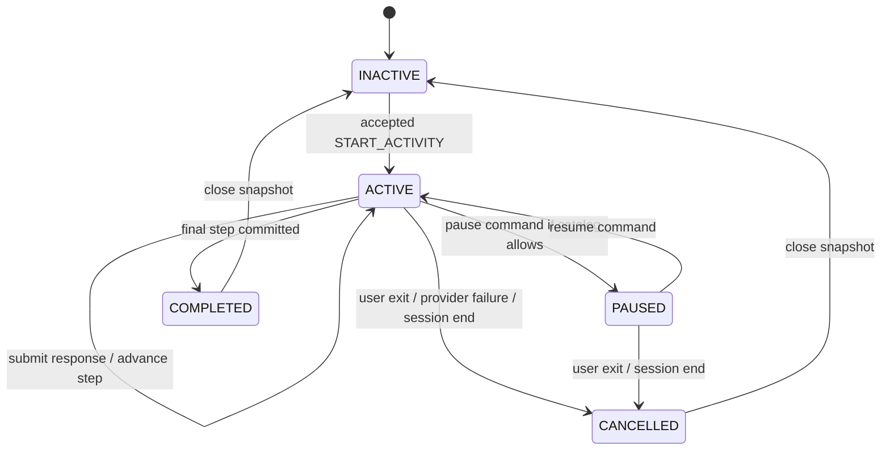

# ActivityRuntime 设计

状态：**FUTURE DESIGN / 不实现**

## 责任

`ActivityRuntime` 是支持活动内部状态的唯一 mutable writer。它只管理活动
步骤、用户回答、开始/完成/取消及活动结果，不拥有：

- scale item、answer、score、pause、resume、completion；
- session end 或 media lifecycle；
- RAG、Dialogue LLM、UI 或 Delivery authority。

## Snapshot

```yaml
ActivityRuntimeSnapshot:
  activity_session_id: string | null
  active_activity: string | null
  activity_category: string | null
  current_step: integer | null
  responses: map
  started_at: timestamp | null
  completed: boolean
  cancelled: boolean
  cancel_reason: string | null
  paused: boolean | null
  pre_rating: number | null
  post_rating: number | null
  metadata: map
```

Snapshot 必须 immutable/read-only。UI、LLM、Agent 只能读取或提交 command，不能
直接修改字段。

## State machine



多步骤活动的 `current_step` 只能由 Runtime 根据已提交 response 推进，不能由
UI 保存旧 step 或由 LLM 跳步。

## Commands

future commands：

```text
OfferActivity(activity_id)       # 只产生 invitation
AcceptActivity(activity_id)      # 明确 opt-in 后转换为 start
StartActivity(activity_id)
SubmitActivityResponse(response)
PauseActivity(reason)
ResumeActivity()
CancelActivity(reason)
CompleteActivity()
```

`StartActivity` 必须检查 catalog eligibility、session cooldown、active scale
冲突和 user opt-in；重复 start、未知 activity 或缺少 opt-in 必须拒绝。

## Events

```text
ActivityOffered
ActivityAccepted
ActivityStarted
ActivityStepAdvanced
ActivityPaused
ActivityResumed
ActivityCancelled
ActivityCompleted
ActivityError
```

事件是事实记录，不是第二套决策系统。SessionEngine 只接收必要的 lifecycle
projection；ScaleRuntime 只在 Policy 明确允许时 pause/resume。

## State owner 边界

```text
TurnPolicy
   ├── ScaleRuntime       questionnaire state
   ├── SessionEngine      session/media lifecycle
   └── ActivityRuntime    support activity state
```

ActivityRuntime 不得直接调用 ScaleRuntime 改分、不允许 SessionEngine 自行启动
活动，也不允许 LLM 通过文本标签提交 command。

## Failure recovery

| 故障 | 处理 |
|---|---|
| Agent unavailable | deterministic observation；不主动推荐复杂 activity |
| Catalog asset missing | 不启动，回到 CHAT |
| Runtime exception | cancel activity；保留 Scale/Session state；回安全聊天 |
| LLM generation failure | 不回滚已提交用户选择；保留活动 snapshot |
| TTS failure | UI text 可继续；记录 TTS error |
| 用户关闭活动 | `CANCELLED`；依据 snapshot 决定回 CHAT 或 resume scale |
| Session end during activity | SessionEngine command；ActivityRuntime cancel/close |

## Data boundary

Runtime 可提供 `ActivitySessionRecord` 的事实快照，但不能生成诊断、复吸风险、
意志力或治疗成功结论。所有结果都要标注活动完成/取消状态和 evidence status。
