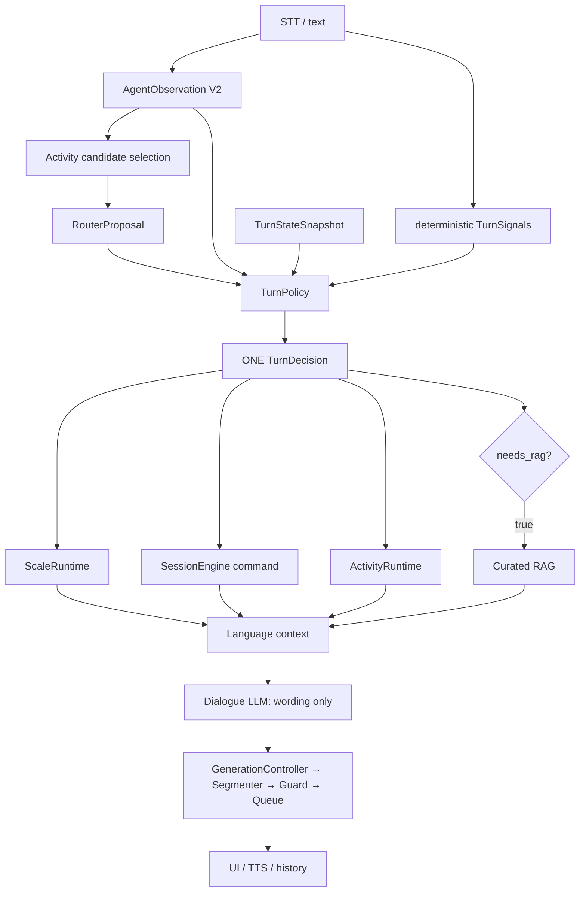

# Adaptive Activities 与现有架构的集成设计

状态：**FUTURE DESIGN / 当前不接线**

## 总体关系



## 与 Agent 的关系

AgentObservation V2 只增加 stage/load/need/readiness 等 observation。Agent 不
能输出可直接执行的 `START_ACTIVITY`，也不能写 ActivityRuntime。候选活动由
Catalog 约束，再作为不可执行 RouterProposal 进入 TurnPolicy。

## 与 TurnPolicy 的关系

未来可扩展一个高层 `RECOMMEND_SUPPORT_ACTIVITY` 决定，或在内部先产生
`SupportActivityCandidate` 再由 Policy 批准。两者都必须保留：

```text
recommend ≠ start
```

用户接受必须是独立的 command/Signal；没有 opt-in 就不能启动 ActivityRuntime。

## 与 ScaleRuntime 的关系

量表回答提交顺序不变：

```text
ScaleAnswerInterpreter → ScaleRuntime.accept_answer()
    ↓
构建上下文
    ↓
activity candidate / offer（如果 Policy 允许）
```

活动不得改分、跳题或保存旧题号。暂停/恢复仍由 ScaleRuntime 根据自己的
snapshot 推导 first unanswered item。

## 与 SessionEngine 的关系

SessionEngine 继续管理 session/media lifecycle。ActivityRuntime 通过明确的
command/event 与 SessionEngine 协作，不能建立第二套 session FSM。活动取消或
会话结束时，两个 writer 各自只清理自己的 domain。

## 与 RAG 的关系

活动需要知识时也必须使用 `TurnDecision.needs_rag`。Agent 或 ActivityRuntime
不能自行检索，活动结果不能改变 RAG gate。

## 与 Dialogue LLM 的关系

LLM 只得到已批准的 activity context，并负责：

- 自然邀请；
- 角色语言；
- 反映和澄清；
- 结束语。

LLM 不能升级 level、跳步骤、判断通过/失败、换 activity、提交结果或结束会话。

## 与 Delivery 的关系

活动切换前后仍使用既有 generation-scoped delivery。活动开始不能让旧 generation
继续播放；取消必须让 stale text/audio fail closed。Delivery 不拥有活动业务权。

## 与 UI 的关系

UI 只显示 offer、接受/拒绝/退出按钮和 ActivityRuntime snapshot；按钮产生
command，不直接改 runtime。活动 UI 必须统一包含 header、progress、main area、
primary action 和 exit action，禁止排名、惩罚音效和羞辱性失败动画。

## 与 Data/Report 的关系

ActivityRuntime 产生事实 record；Data/Report 读取 committed record。报告不把
活动结果重写成诊断或疗效判断。

## 部署关系

活动框架运行在 Windows application runtime；WSL2 仍只承担 profile-owned vLLM。
ActivityRuntime 不改变 Agent/dialogue model topology，不改变 GPU budget，也不
改变 v2 runtime baseline。
